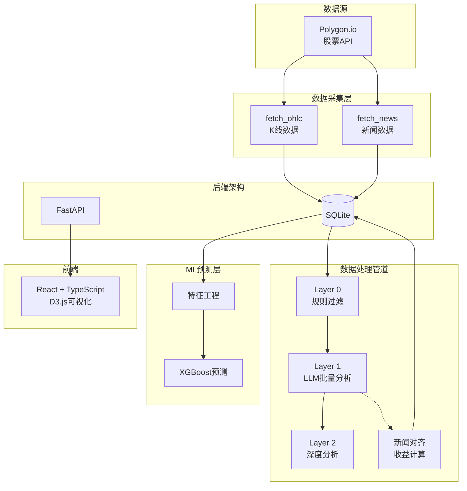
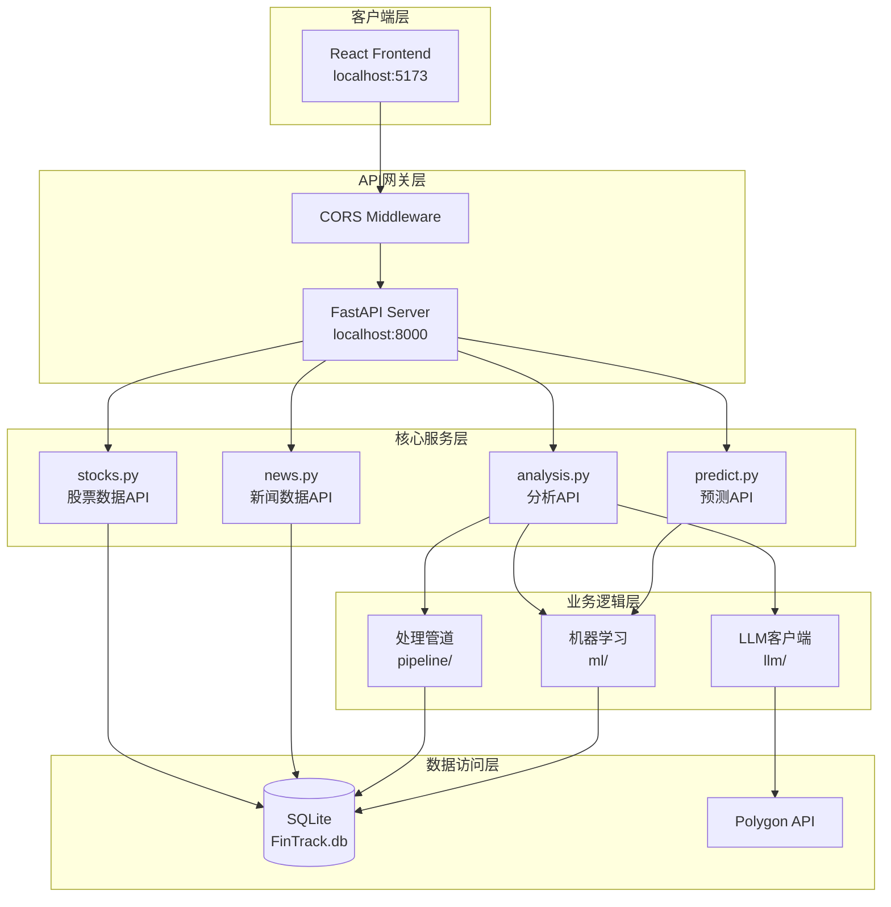
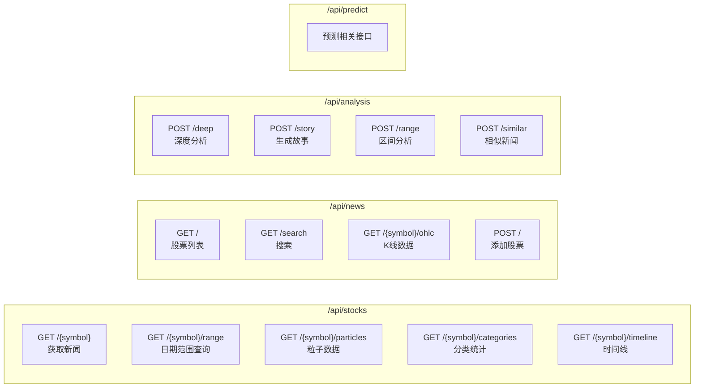
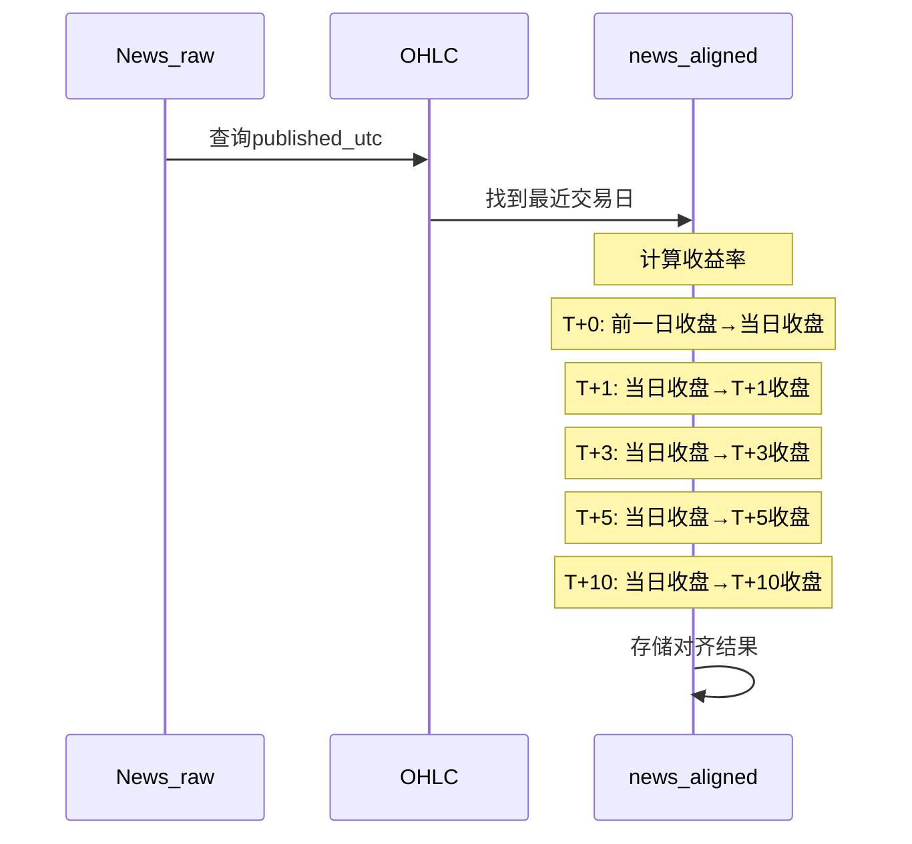

# FinTrack - 智能股票新闻分析系统

> 基于 AI 的股票新闻分析系统，将新闻与股价走势关联，实现智能选股决策支持


基于LLM的区间分析：


## 系统概览

FinTrack 是一个端到端的股票新闻分析平台，通过多层级 AI 管道将海量新闻数据转化为可操作的交易 insights。



## 核心特性

- **多层级新闻分析**: 从规则过滤到 LLM 深度分析，成本可控
- **新闻-股价对齐**: 自动将新闻对齐到交易日，计算 T+0/1/3/5/10 收益
- **智能选股推荐**: 基于历史新闻与价格关系的 ML 预测模型
- **实时数据更新**: 后台定时抓取最新市场数据
- **交互式可视化**: D3.js 粒子图、收益曲线、新闻热力图

## 系统架构

### 整体架构图



### API 路由结构



## 数据流架构

### 新闻处理管道

```mermaid
flowchart LR
    subgraph 输入
        NEWS[Polygon News<br/>原始新闻]
    end

    subgraph Layer 0 规则过滤
        R1[空描述检查]
        R2[长度检查]
        R3[市场汇总过滤]
        R4[列表文章过滤]
    end

    subgraph Layer 1 LLM批量分析
        E1[关键词提取]
        E2[50篇/批]
        E3[相关性判断]
        E4[情感分析]
    end

    subgraph Layer 2 深度分析
        D1[按需触发]
        D2[详细分析]
        D3[原因归因]
    end

    subgraph 收益计算
        RET[对齐交易日<br/>计算T+0/1/3/5/10收益]
    end

    NEWS --> R1
    R1 --> R2
    R2 --> R3
    R3 --> R4
    R4 --> E1
    E1 --> E2
    E2 --> E3
    E3 --> E4
    E4 --> D1
    D1 --> D2
    D2 --> D3
    D3 --> RET

    style R1 fill:#e1f5fe
    style E2 fill:#fff3e0
    style D2 fill:#e8f5e9
    style RET fill:#fce4ec
```



### 新闻-股价对齐流程



## 数据库架构

```mermaid
erDiagram
    tickers ||--o{ ohlc : "has"
    tickers ||--o{ news_ticker : "mentioned_in"
    news_raw ||--o{ news_ticker : "has"
    news_raw ||--o{ layer0_results : "filtered_by"
    news_raw ||--o{ layer1_results : "analyzed_by"
    news_raw ||--o{ layer2_results : "deep_analyzed"
    news_raw ||--o{ news_aligned : "aligned_to"

    tickers {
        string symbol PK
        string name
        string sector
        string last_ohlc_fetch
        string last_news_fetch
    }

    ohlc {
        string symbol PK,FK
        string date PK
        float open
        float high
        float low
        float close
        float volume
        float vwap
        int transactions
    }

    news_raw {
        string id PK
        string title
        string description
        string publisher
        string author
        string published_utc
        string article_url
        string amp_url
        string tickers_json
        string insights_json
    }

    news_ticker {
        string news_id PK,FK
        string symbol PK,FK
    }

    layer0_results {
        string news_id PK,FK
        string symbol PK,FK
        int passed
        string reason
    }

    layer1_results {
        string news_id PK,FK
        string symbol PK,FK
        string relevance
        string key_discussion
        string chinese_summary
        string sentiment
        string discussion
        string reason_growth
        string reason_decrease
    }

    layer2_results {
        string news_id PK,FK
        string symbol PK,FK
        string discussion
        string growth_reasons
        string decrease_reasons
        string created_at
    }

    news_aligned {
        string news_id PK,FK
        string symbol PK,FK
        string trade_date PK
        string published_utc
        float ret_t0
        float ret_t1
        float ret_t3
        float ret_t5
        float ret_t10
    }
```



## 模块说明

### 1. 数据采集层 (`backend/polygon/`)

| 模块 | 功能 |
|------|------|
| `client.py` | Polygon.io API 封装 |

**核心函数**:

```python
# 获取K线数据
fetch_ohlc(ticker: str, start: str, end: str) -> List[Dict]

# 获取新闻数据
fetch_news(ticker: str, start: str, end: str) -> List[Dict]

# 搜索股票
search_tickers(query: str, limit: int) -> List[Dict]
```

### 2. 处理管道层 (`backend/pipeline/`)

#### Layer 0: 规则过滤 (`layer0.py`)

免费层，使用规则过滤明显无关的新闻：

- 空描述过滤
- 描述过短过滤 (<30字符)
- 市场汇总文章过滤 (>10只股票)
- 列表文章过滤 (如"Top 10...")

**预期过滤率**: 25-35%

#### Layer 1: LLM批量分析 (`layer1.py`)

低成本层，50篇新闻打包一次 API 调用：

```python
# 关键词提取
_extract_relevant_text(description, symbol)

# 批量处理
run_layer1(symbol: str, max_articles: int) -> Dict

# 批量API (可选)
submit_batch_api(symbol: str, articles: List) -> str
```

**输出格式**:
```json
{
  "i": 0,
  "r": "y|n",           // 是否相关
  "s": "+|-0",          // 情感
  "e": "10词摘要",
  "u": "上涨原因",
  "d": "下跌原因"
}
```

#### Layer 2: 深度分析 (`layer2.py`)

按需层，用户点击文章时触发：

```python
# 单篇文章深度分析
analyze_article(news_id: str, symbol: str) -> Dict

# 生成股票故事
generate_story(symbol: str, csv_content: str) -> str

# 区间分析
analyze_range(symbol, start_date, end_date) -> Dict
```

#### 新闻对齐 (`alignment.py`)

将新闻发布时间映射到最近的交易日：

```python
align_news_for_symbol(symbol: str) -> Dict
# 计算 T+0, T+1, T+3, T+5, T+10 收益率
```

### 3. 机器学习层 (`backend/ml/`)

| 模块 | 功能 |
|------|------|
| `model.py` | XGBoost 训练与预测 |
| `features.py` | 特征工程 |
| `backtest.py` | 回测模块 |
| `inference.py` | 推理接口 |
| `lstm_model.py` | LSTM实验模型 |

**特征工程** (`features.py`):
- 价格技术指标 (RSI, MACD, 布林带)
- 波动率特征
- 成交量特征
- 新闻情绪特征

**模型训练**:
```python
# 单股模型
train(symbol: str, horizon: str) -> Dict

# 统一模型 (多股合并)
train_unified(horizon: str, symbols: List) -> Dict

# 预测
predict(symbol: str, horizon: str) -> Dict
```

### 4. API 层 (`backend/api/routers/`)

#### stocks.py - 股票数据接口

```python
GET /api/stocks/{symbol}           # 获取新闻
GET /api/stocks/{symbol}/range     # 日期范围查询
GET /api/stocks/{symbol}/particles # 粒子可视化数据
GET /api/stocks/{symbol}/categories# 新闻分类
GET /api/stocks/{symbol}/timeline  # 时间线标记
```

#### news.py - 新闻数据接口

```python
GET  /api/news                    # 股票列表
GET  /api/news/search             # 模糊搜索
GET  /api/news/{symbol}/ohlc      # K线数据
POST /api/news                    # 添加股票(触发后台抓取)
```

#### analysis.py - 分析接口

```python
POST /api/analysis/deep           # 深度分析
POST /api/analysis/story          # 生成故事
POST /api/analysis/range          # 区间分析
POST /api/analysis/range-local    # 本地分析(免费)
POST /api/analysis/similar        # 相似新闻
```

#### predict.py - 预测接口

```python
# 预测相关端点
```

### 5. LLM 客户端 (`backend/llm/`)

统一支持多种 LLM 提供商：

```python
# 配置
llm_provider: "siliconflow" | "anthropic"

# SiliconFlow 模型
- deepseek-ai/DeepSeek-R1
- deepseek-ai/DeepSeek-V3
- Qwen/Qwen2.5-72B-Instruct

# Anthropic 模型
- claude-haiku-4-5-20251001
- claude-sonnet-4-5-20250929
```

## 快速开始

### 环境要求

- Python 3.10+
- Node.js 18+
- SQLite3

### 安装

```bash
# 1. 克隆项目
git clone <repo-url>
cd FinTrack

# 2. 创建虚拟环境
python -m venv venv
source venv/bin/activate  # Linux/Mac
# 或
venv\Scripts\activate     # Windows

# 3. 安装依赖
pip install -r requirements.txt

# 4. 配置环境变量
cp .env.example .env
# 编辑 .env 填入 API Key
```

### 配置 (.env)

```env
# Polygon.io API (必需)
POLYGON_API_KEY=your_polygon_api_key

# LLM 提供商 (二选一)
# SiliconFlow (推荐，性价比高)
SILICONFLOW_API_KEY=your_siliconflow_key

# 或 Anthropic
ANTHROPIC_API_KEY=your_anthropic_key

# LLM 选择
LLM_PROVIDER=siliconflow
```

### 启动服务

```bash
# 启动后端 (端口 8000)
cd backend
uvicorn api.main:app --reload

# 启动前端 (端口 5173)
cd frontend
npm install
npm run dev
```

### 添加股票示例

```bash
# 通过 API 添加股票
curl -X POST http://localhost:8000/api/news \
  -H "Content-Type: application/json" \
  -d '{"symbol": "AAPL", "name": "Apple Inc."}'
```

## 技术栈

| 层级 | 技术 |
|------|------|
| 后端框架 | FastAPI |
| 前端框架 | React + TypeScript |
| 可视化 | D3.js |
| 数据库 | SQLite (WAL模式) |
| ML 框架 | XGBoost, Scikit-learn, NumPy |
| 数据源 | Polygon.io |
| LLM | SiliconFlow / Anthropic |

## 成本优化策略

```mermaid
flowchart TB
    subgraph 成本层级
        FREE[Layer 0<br/>规则过滤<br/>$0]
        CHEAP[Layer 1<br/>批量分析<br/>~$0.002/篇]
        EXPENSIVE[Layer 2<br/>深度分析<br/>~$0.01/篇]
    end

    FREE --> |"35%过滤"| CHEAP
    CHEAP --> |"用户点击"| EXPENSIVE

    Note over FREE: 零成本
    Note over CHEAP: 批量折扣50%
    Note over EXPENSIVE: 按需触发
```

## 目录结构

```
FinTrack/
├── backend/
│   ├── api/
│   │   ├── main.py              # FastAPI 应用入口
│   │   └── routers/
│   │       ├── stocks.py        # 股票数据API
│   │       ├── news.py          # 新闻数据API
│   │       ├── analysis.py      # 分析API
│   │       └── predict.py       # 预测API
│   ├── pipeline/
│   │   ├── layer0.py            # 规则过滤
│   │   ├── layer1.py            # LLM批量分析
│   │   ├── layer2.py            # 深度分析
│   │   ├── alignment.py         # 新闻对齐
│   │   └── similarity.py        # 相似度检索
│   ├── ml/
│   │   ├── model.py             # XGBoost模型
│   │   ├── features.py          # 特征工程
│   │   ├── backtest.py          # 回测
│   │   └── models/              # 模型文件
│   ├── polygon/
│   │   └── client.py            # Polygon API封装
│   ├── llm/
│   │   └── client.py            # LLM统一客户端
│   ├── database.py              # SQLite数据库
│   └── config.py                # 配置管理
├── frontend/
│   ├── src/
│   │   ├── components/          # React组件
│   │   ├── pages/               # 页面
│   │   └── utils/               # 工具函数
│   └── package.json
├── .env                         # 环境变量
└── README.md                    # 本文档
```

## 常见问题

### Q: 如何添加新的股票?

```bash
# 方式1: API
POST /api/news {"symbol": "NVDA"}

# 方式2: 代码
python -c "from backend.polygon.client import fetch_ohlc, fetch_news; ..."
```

### Q: 为什么不使用 PostgreSQL?

当前使用 SQLite 是为了简化部署。对于生产环境，可以迁移到 PostgreSQL。

### Q: Layer 1 如何降低成本?

- 批量处理: 50篇/次 API 调用
- 关键词提取: 长描述只保留相关内容
- 批量 API: 支持 Anthropic 批量处理 (50% 折扣)

## 许可证

MIT License

## 贡献指南

欢迎提交 Issue 和 Pull Request！

---

**技术栈版本** (供参考):
- Python: 3.10+
- FastAPI: 0.100+
- React: 18+
- Node.js: 18+
- XGBoost: 2.0+