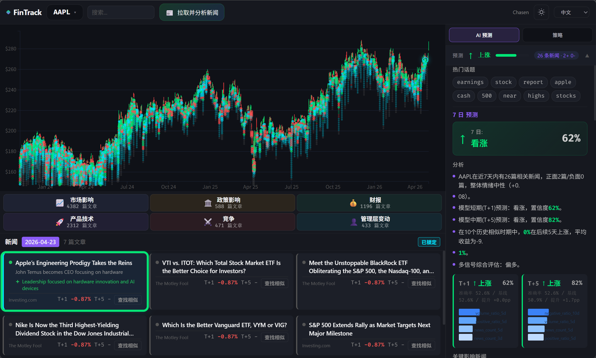
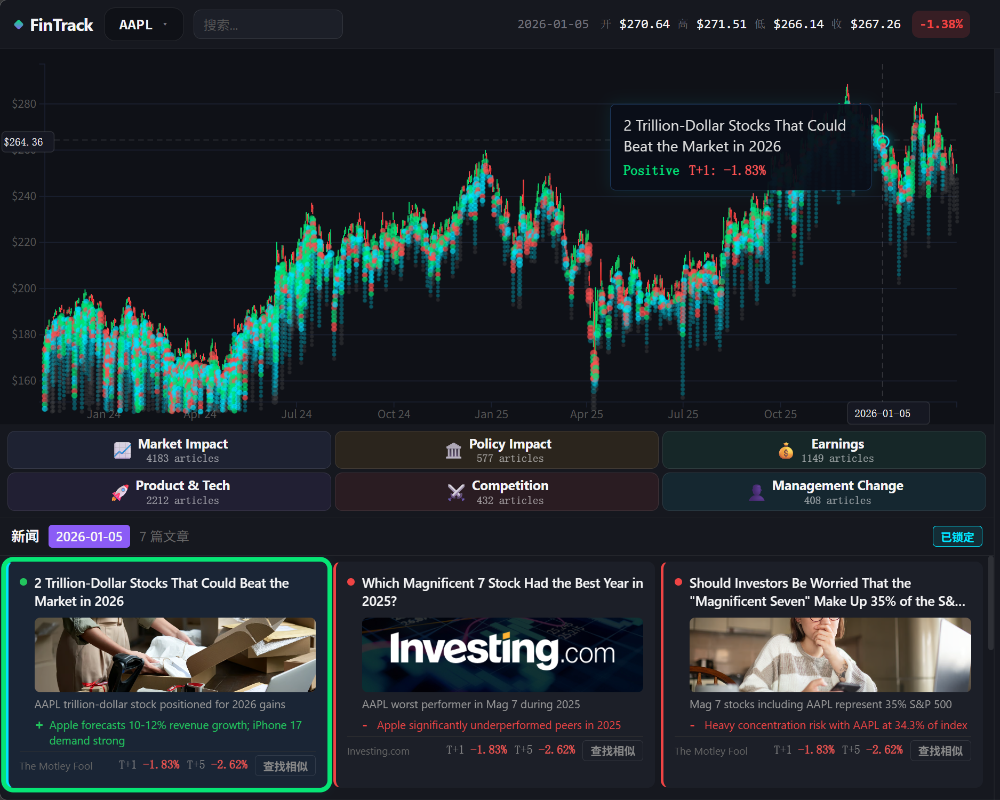
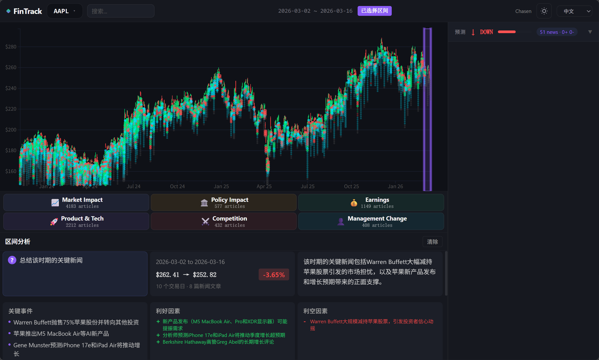
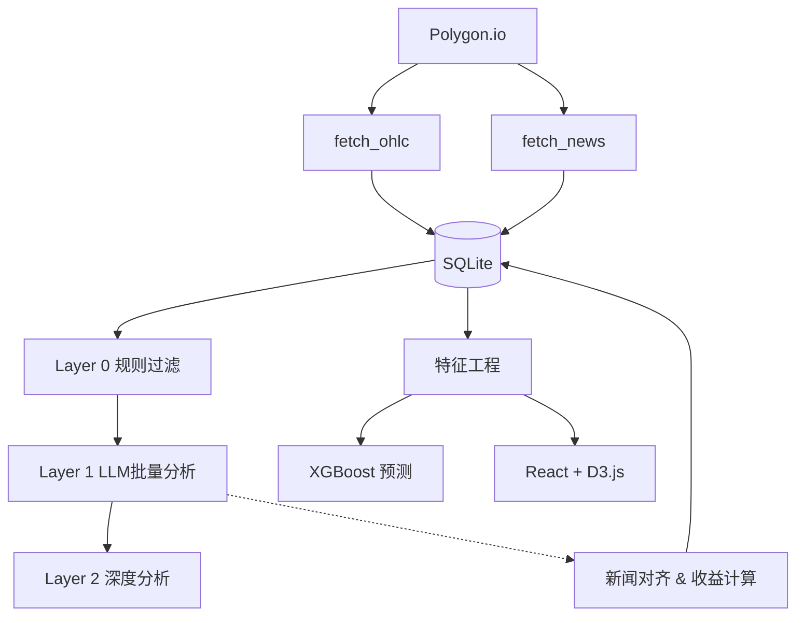
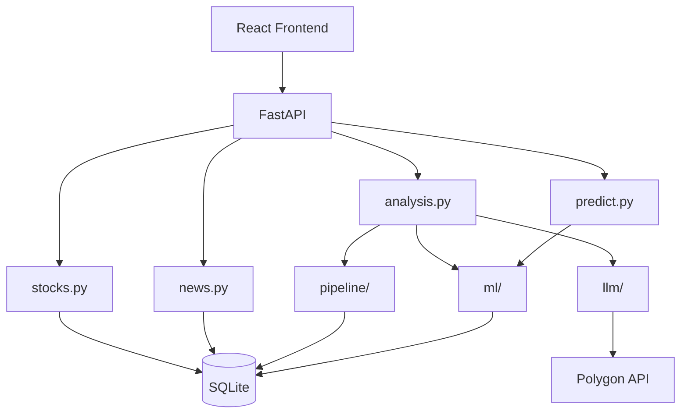
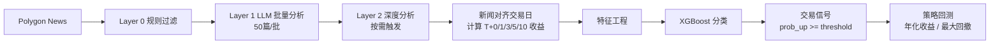

# FinTrack - 智能股票新闻分析与量化交易系统

> 基于 AI 的股票新闻分析系统，将新闻与股价走势关联，实现智能选股决策支持。







## 系统概览

FinTrack 是一个端到端的股票新闻分析与量化交易平台，通过多层级 AI 管道将海量新闻数据转化为可执行的交易信号。



## 核心特性

- **多层级新闻分析**：Layer 0 规则过滤 → Layer 1 LLM 批量分析 → Layer 2 按需深度分析，成本可控
- **一键拉取并分析新闻**：前端顶栏支持直接触发 fetch → 对齐 → Layer 0 → Batch Layer 1，并展示阶段状态与进度
- **新闻-股价对齐**：自动将新闻映射到最近交易日，计算 T+0/1/3/5/10 收益
- **AI 量化策略**：基于新闻情绪与价格特征的 XGBoost 预测模型，支持策略回测与最优参数扫描
- **交互式可视化**：D3.js 粒子图、收益曲线、新闻热力图

## 系统架构



## 数据流与新闻处理管道



## 金融算法实现

### 1. 特征工程 (`backend/ml/features.py`)

特征矩阵以**每个交易日**为一条样本，严格使用 `shift(1)` 避免前视偏差。

**新闻情绪特征**
| 特征 | 说明 |
|------|------|
| `sentiment_score` | (正面数 − 负面数) / 总文章数 |
| `relevance_ratio` | 高/中相关文章占比 |
| `positive_ratio` / `negative_ratio` | 正面/负面文章占比 |
| `sentiment_score_3d/5d/10d` | 滚动平均情绪得分 |
| `sentiment_momentum_3d` | 3 日情绪均值 − 10 日情绪均值 |
| `news_count_3d/5d/10d` | 滚动窗口新闻总量 |

**价格与技术特征**
| 特征 | 说明 |
|------|------|
| `ret_1d/3d/5d/10d` | 历史收益率（已 shift(1)） |
| `volatility_5d/10d` | 滚动波动率 |
| `volume_ratio_5d` | 当日成交量 / 5 日均量 |
| `gap` | 开盘跳空率 |
| `ma5_vs_ma20` | 均线偏离度 |
| `rsi_14` | 14 日 RSI |
| `day_of_week` | 星期几（季节因子） |

**目标变量**
- `target_t1` / `target_t5`：标准涨跌方向标签
- `target_up_big_t5`：`T+5` 涨幅超过 3% 的低噪声标签
- `target_big1_t5` / `target_big2_t5`：未来 5 日绝对波动超过 1% / 2%

### 2. 模型训练 (`backend/ml/model.py`)

采用 **XGBoost 分类器**，支持单股模型与统一模型（多股合并）：

```python
XGBClassifier(
    max_depth=4,
    n_estimators=200,
    learning_rate=0.05,
    subsample=0.8,
    colsample_bytree=0.8,
    eval_metric="logloss",
)
```

- **扩展窗口验证**（`backend/ml/walk_forward.py`）：参数搜索和实验评估采用 expanding-window CV；启用文本特征的实验会在每折训练窗口内拟合文本变换器，再转换测试窗口
- **显式目标列**：`--target-col` 参数支持传入任意目标列（如 `target_up_big_t5`），自动推导对应收益列用于中性过滤
- **评估指标**：Accuracy、Precision、Recall、F1、ROC-AUC，并与基线（多数类占比）对比
- **模型持久化**：`.joblib` + XGBoost 原生 `.json` 格式双保存，元数据保存为 `_meta.json`；非默认目标列会写入带目标后缀的独立产物，避免覆盖标准 `target_t5` 模型

### 3. 评估报告 (`backend/ml/evaluation_report.py`)

多股票聚合评估工具：

```bash
python -m backend.ml.train --evaluation-report --horizon t5 --target-col target_up_big_t5 --metric roc_auc
```

输出 `evaluation_summary.json`，包含每只股票的 AUC、准确率、Lift，以及跨股票的平均 AUC、中位数和超过 0.5 的比例。

### 4. 策略回测 (`backend/ml/strategy_backtest.py`)

将模型输出的上涨概率 `prob_up` 转换为**long/cash 交易信号**：

```
signal = 1  if prob_up >= threshold  else 0
```

**权益曲线模拟**
- 初始资金 1.0，信号生效于次日开盘至再下一日开盘
- 每次换仓收取 `fee_rate = 0.1%` 手续费
- 持仓日收益 = 当日收盘价 / 前日收盘价 − 1

**核心评价指标**
| 指标 | 计算方式 |
|------|----------|
| 年化收益率 | $(E_{end}/E_{start})^{1/years} - 1$，按 252 交易日/年 |
| 最大回撤 | $\max\{(peak - equity)/peak\}$ |
| 胜率 | 盈利交易次数 / 总交易次数 |
| 累计收益率 | $E_{end} / E_{start} - 1$ |
| 买入持有收益率 | 同期单纯持有股票的收益率 |

**最优策略扫描**
- 支持对多只股票、多阈值（0.50/0.55/0.60/0.65/0.70）、多 horizon（t1/t5）进行批量回测
- 选择满足课程目标（年化收益 > 20% 且最大回撤 < 20%）的最优策略写入 `strategy_best.json`

## 快速开始

### 环境要求
- Python 3.10+
- Node.js 18+

### 安装
```bash
python -m venv venv
venv\Scripts\activate          # Windows
pip install -r requirements.txt
cp .env.example .env            # 填入 POLYGON_API_KEY 与 LLM Key
```

### 启动服务

**后端**（项目根目录）
```powershell
.\venv\Scripts\python.exe -m uvicorn backend.api.main:app --host 127.0.0.1 --port 8000
```
访问：http://127.0.0.1:8000/docs

**前端**
```powershell
cd frontend
npm run dev
```
访问：终端输出的 Vite 本地地址（通常为 `http://127.0.0.1:5173/PokieTicker/` 或 `http://localhost:7777/PokieTicker/`）

### 顶栏一键“拉取并分析新闻”

启动前后端后：

1. 在顶栏选择股票代码
2. 点击 `📰 Fetch & Analyze News`
3. 系统会依次执行：
    - Polygon 行情与新闻拉取
    - 新闻与交易日对齐
    - Layer 0 规则过滤
    - Layer 1 Batch 提交与轮询
4. 完成后自动刷新新闻面板、分类面板与图表粒子层

状态卡会在顶栏显示当前阶段、已处理数量、相关文章数量和队列进度。

### 环境变量与外部依赖

要完整运行“一键拉取并分析新闻”，至少需要以下配置：

- `polygon_api_key`：用于拉取 OHLC 与新闻数据
- `anthropic_api_key`：用于 Layer 1 Batch 分析

如果缺少或无效：

- Polygon 不可用时，请求可能停留在拉取阶段或返回抓取错误
- Anthropic 不可用时，后端会返回友好的失败状态，而不是 500 异常

建议在项目根目录创建 `.env`：

```env
polygon_api_key=your_polygon_key
anthropic_api_key=your_anthropic_key
```

### 常用运维命令

| 操作 | 命令 |
|------|------|
| 批量补齐未抓取股票 | `python -m backend.bulk_fetch` |
| 增量更新已有股票 | `python -m backend.weekly_update` |
| 单股 Layer 1 情感分析 | `python -c "from backend.pipeline.layer1 import run_layer1; run_layer1('AAPL')"` |
| 批量 Layer 1 分析 | `python -m backend.batch_submit --top 50` |
| 策略回测扫描 | `python -m backend.ml.strategy_backtest --scan` |
| 查看单策略详情 | `python -m backend.ml.strategy_backtest --symbol MU --horizon t5 --threshold 0.65` |

### ML 训练与评估命令

```powershell
# 参数搜索（扩展窗口 CV）
python -m backend.ml.train --search-params --symbol AAPL --horizon t5

# 使用显式低噪声目标搜索，输出文件会带 target_up_big_t5 后缀
python -m backend.ml.train --search-params --symbol AAPL --horizon t5 --target-col target_up_big_t5 --metric roc_auc

# 生成多股票评估报告
python -m backend.ml.train --evaluation-report --horizon t5 --target-col target_up_big_t5 --metric roc_auc --evaluation-output backend/ml/models/evaluation_summary.json
```

## 技术栈

| 层级 | 技术 |
|------|------|
| 后端 | FastAPI + SQLite (WAL) |
| 前端 | React 19 + TypeScript + Vite + D3.js |
| 机器学习 | XGBoost + Scikit-learn + NumPy + Pandas |
| 数据源 | Polygon.io |
| LLM | SiliconFlow / Anthropic / MiniMax |

## 目录结构

```
FinTrack/
├── backend/
│   ├── api/routers/          # FastAPI 路由
│   ├── pipeline/             # 新闻处理管道 (L0/L1/L2/对齐)
│   ├── ml/                   # 特征工程、训练、推理、回测
│   ├── polygon/              # Polygon API 封装
│   └── llm/                  # LLM 统一客户端
├── frontend/src/             # React 页面与组件
├── tests/                    # 测试
└── doc/                      # 课程文档与报告
```

## 许可证

MIT License

---
> 作者：Chasen ；欢迎交流
---
