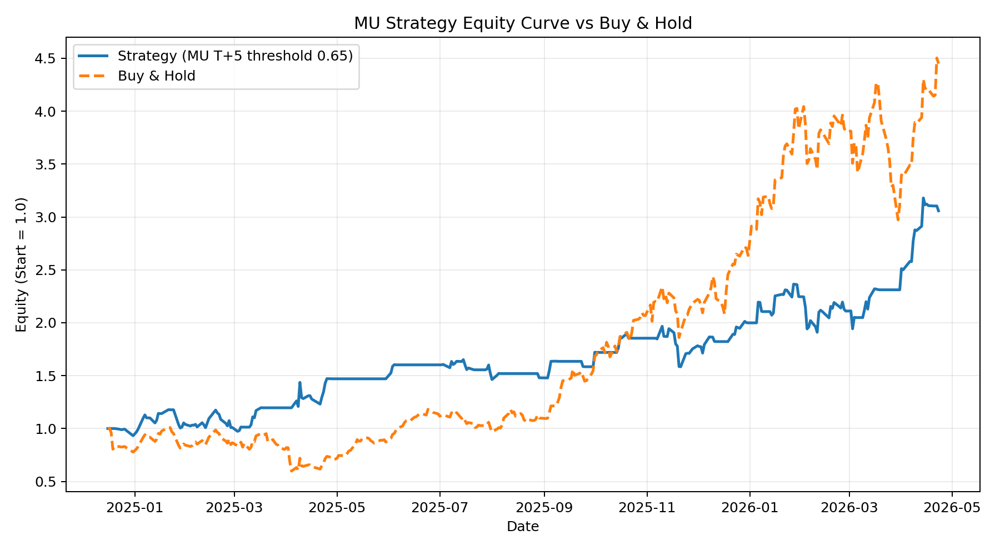
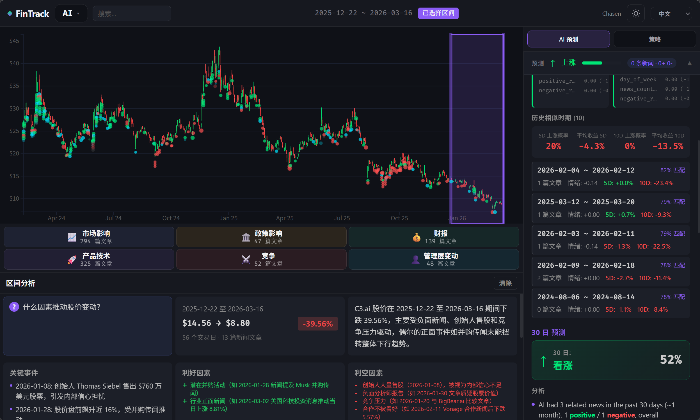
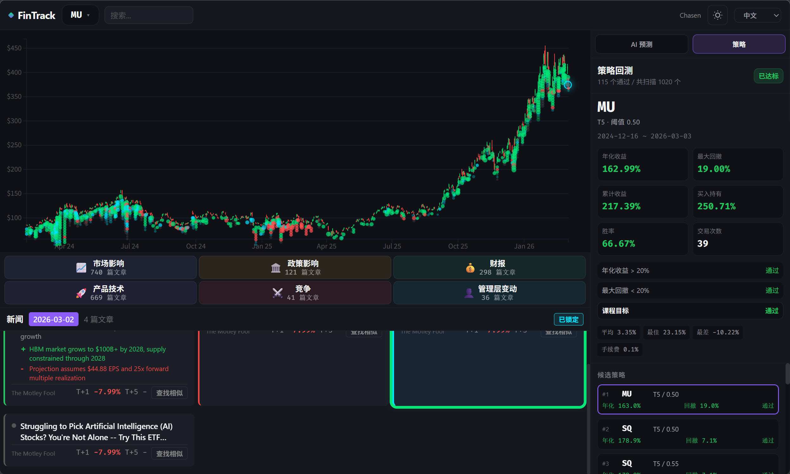
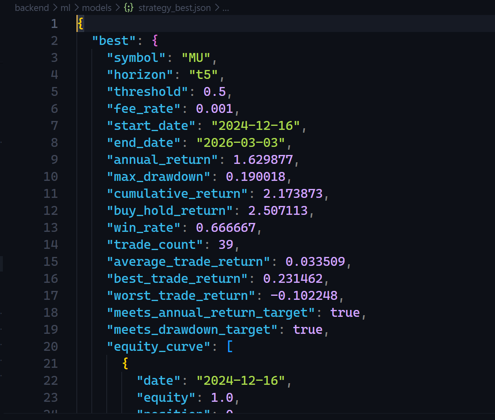
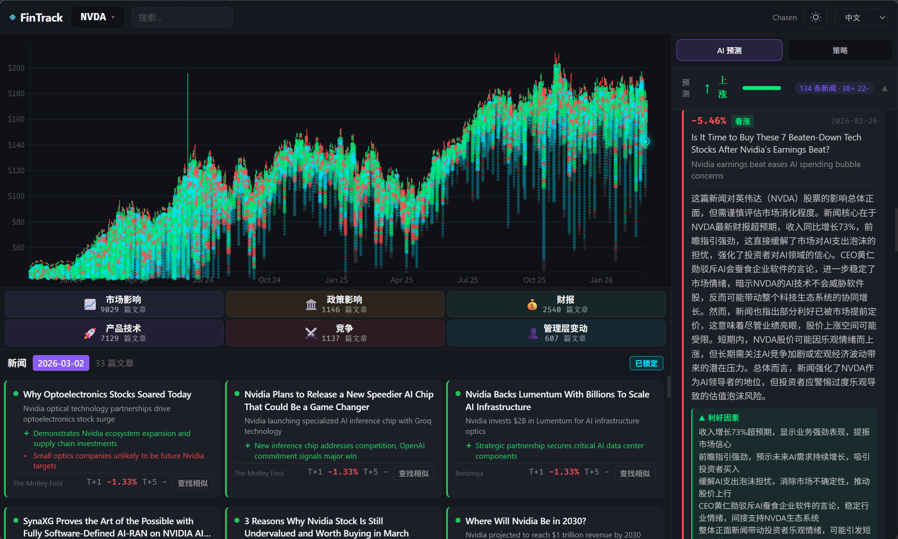
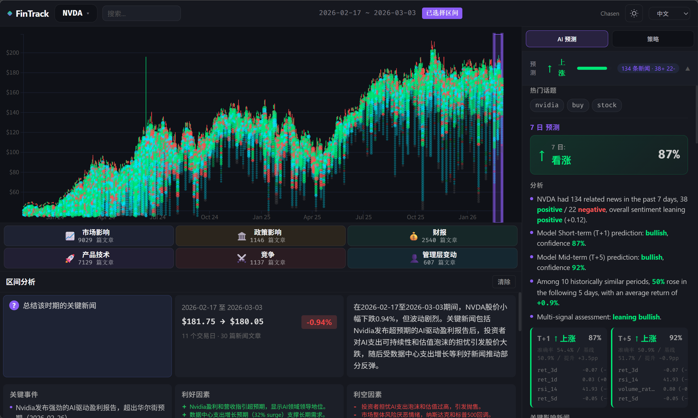

# 项目七：基于 AI 算法的量化交易策略课程设计报告

> 报告命名：项目七_计算机科学与技术_23251102132_廖朝正  
> 专业：计算机科学与技术  
> 学号：23251102132  
> 姓名：廖朝正  
> 指导教师：智能系统课程设计任课教师  
> 完成日期：2026-05-08

## 摘要

本课程设计围绕"基于 AI 算法的量化交易策略"展开，设计并实现了一个结合股票历史行情、财经新闻情绪分析和机器学习预测的量化交易研究系统。与传统量化策略或纯 LLM 聊天式金融分析不同，本项目的核心创新在于**将大语言模型作为辅助工具参与到特征构造环节**，由 LLM 负责从原始财经新闻中提取情绪、原因和事件类别等语义特征，再将这些结构化特征与价格技术指标一起送入 XGBoost 分类器进行样本外方向预测。这种"LLM 做语义解析、机器学习做统计预测"的分工模式，使系统既保留了 LLM 对文本信息的深层理解能力，又利用了传统机器学习在结构化数据上的统计规律捕捉能力，形成互补。

系统以 Polygon.io 获取的真实股票 OHLC 行情数据和相关新闻数据为基础，经过数据清洗、新闻过滤、LLM 情绪分析、交易日对齐和特征工程后，构建以 XGBoost 为主的股票涨跌方向预测模型，并将预测概率转换为交易信号进行样本外回测。

项目选择 XGBoost 作为主模型，主要原因在于本项目数据以交易日粒度的结构化表格特征为主，样本规模相对有限，而 XGBoost 对中小规模表格数据具有较好的稳定性、训练效率和可解释性。除主模型外，项目还实现了 LightGBM、Random Forest、Logistic Regression 对照实验以及基于 PyTorch 的 LSTM 拓展实验。结果表明，LSTM 在当前数据条件下准确率仅为 39.94%（基线 60.06%），未优于树模型；多模型对比也显示 XGBoost 与 LightGBM、Random Forest 的样本外 AUC 差异很小，说明当前性能瓶颈主要不在算法种类，而在标签噪声、特征表达和任务定义。

在策略评估中，项目采用扩展窗口样本外回测方法，将模型输出概率转换为买入或空仓信号，并计算年化收益率、最大回撤、累计收益率、胜率和交易次数等指标。综合收益、回撤和交易活跃度后，报告选取 MU 股票、T+5 预测周期、阈值 0.65 的策略组合作为代表性结果。该策略在 2024-12-16 至 2026-04-23 的回测区间内取得 130.68% 的年化收益率和 19.43% 的最大回撤，满足课程要求中“年化收益率超过 20%、最大回撤不超过 20%”的指标要求。需要客观看待的是，模型在部分扩展窗口实验中的分类与排序能力仍然偏弱，因此本项目更适合被理解为“在真实数据和完整实验链路下得到的课程实验结果”，而不是已经证明具备稳定泛化能力的实盘策略。

## 一、课程设计目的

本课程设计的主要目标包括以下几个方面：

1. 自主选择并实现一种适用于量化交易场景的 AI 算法。
2. 获取真实或可获取的金融市场数据，包括股票历史行情数据和相关新闻数据。
3. 完成数据清洗、缺失值处理、特征构建和训练集测试集划分。
4. 基于 AI 模型输出预测结果，并将预测结果转换为买入、卖出或持仓信号。
5. 对交易策略进行回测，计算收益率和风险指标。
6. 对策略效果进行总结，分析项目的优点、不足和后续优化方向。

通过本项目，可以加深对机器学习算法、新闻情绪分析、量化交易策略构建和回测评估方法的理解，并掌握将 AI 算法应用到实际金融数据分析中的基本流程。

## 二、课程设计环境

### 2.1 硬件与操作系统环境

本项目在本地 Windows 环境下开发和运行，主要采用 Python 后端、SQLite 数据库和 React 前端完成系统实现。下表给出本次撰写报告时能够直接核验的关键信息。

| 项目 | 说明 |
| --- | --- |
| 操作系统 | Windows 11（10.0.22631） |
| Python 版本 | Python 3.12.4 |
| 开发工具 | VS Code / PowerShell |
| 系统架构 | 64 位（AMD64） |
| 物理内存 | 约 15.73 GB |
| 数据库 | SQLite |
| 后端框架 | FastAPI |
| 前端框架 | React + TypeScript |
| 构建工具 | Vite |
| 可视化 | D3.js |

### 2.2 Python 环境与主要依赖

项目主要使用 Python 进行数据处理、机器学习训练和策略回测。主要依赖如下：

| 依赖库 | 用途 |
| --- | --- |
| numpy | 数值计算 |
| pandas | 表格数据处理、特征工程 |
| scikit-learn | 模型评估、机器学习辅助工具 |
| xgboost | XGBoost 分类模型训练与预测 |
| requests | 调用 Polygon.io 等外部接口 |
| fastapi | 后端 API 服务 |
| uvicorn | FastAPI 服务运行 |
| pydantic-settings | 环境变量和配置管理 |
| openai / anthropic | LLM 接口调用 |
| torch | 深度学习实验依赖 |
| pytest | 测试框架 |
| vite | 前端构建工具 |

### 2.3 数据来源

本项目的数据来源主要包括：

1. 股票行情数据：Polygon.io 提供的日频 OHLC 数据，包括开盘价、最高价、最低价、收盘价、成交量、VWAP 和交易笔数。
2. 财经新闻数据：Polygon.io 提供的股票相关新闻，包括标题、摘要、发布时间、发布来源、关联股票等。
3. 新闻情绪分析结果：通过 LLM 对新闻摘要进行相关性判断、情绪分类和原因提取。

以本次课程报告使用的实验快照为准，当前本地数据库中已保存 105 只股票、56676 条 OHLC 行情数据、63831 条原始新闻数据、117078 条新闻交易日对齐数据和 110970 条 Layer 1 新闻情绪分析结果。上述统计用于说明数据规模，后续再次拉取数据后数量可能发生变化。

## 三、课程设计原理

### 3.1 量化交易策略整体思路

本项目的基本思路是：股票价格变化不仅受到历史价格走势、成交量和技术指标影响，也可能受到相关新闻事件影响。因此，项目将行情数据和新闻情绪数据结合起来，构建机器学习特征，并训练模型预测未来一段时间内股票价格是否上涨。

整体流程如下：

1. 获取股票历史行情和相关新闻。
2. 对原始新闻进行规则过滤，删除空摘要、过短摘要、市场综述和榜单类文章。
3. 使用 LLM 对新闻进行批量情绪分析，提取新闻相关性、情感方向、摘要、上涨原因和下跌原因。
4. 将新闻发布时间对齐到交易日，并计算新闻发布后 T+0、T+1、T+3、T+5、T+10 收益。
5. 按交易日聚合新闻特征，并结合价格技术指标构建机器学习特征。
6. 使用 XGBoost 模型预测未来 T+1 或 T+5 股票价格方向。
7. 根据模型输出概率和阈值生成交易信号。
8. 进行策略回测，计算收益和风险指标。

### 3.2 XGBoost 算法原理

XGBoost 是一种基于梯度提升树的机器学习算法。它通过逐步训练多棵决策树，使后一棵树不断修正前面模型的预测误差，最终形成一个强预测模型。

在二分类任务中，XGBoost 的输入是特征矩阵，输出是样本属于正类的概率。本项目中，正类表示未来指定周期后股票收盘价高于当前收盘价，即股票价格上涨。

从数学形式上看，XGBoost 将第 \(i\) 个样本的预测值表示为多棵树输出之和：

\[
\hat{y}_i = \sum_{k=1}^{K} f_k(x_i), \qquad f_k \in \mathcal{F}
\]

其中，\(x_i\) 表示输入特征，\(f_k\) 表示第 \(k\) 棵回归树，\(\mathcal{F}\) 表示所有候选树结构的集合。模型训练的目标是最小化“损失函数 + 正则项”：

\[
\mathcal{L} = \sum_{i=1}^{n} l(y_i, \hat{y}_i) + \sum_{k=1}^{K} \Omega(f_k)
\]

其中，\(l(y_i, \hat{y}_i)\) 用于衡量预测值与真实值之间的误差；\(\Omega(f_k)\) 是对树复杂度的惩罚项，用于抑制过拟合。XGBoost 的一大特点是采用加法模型逐轮优化，即在第 \(t\) 轮迭代时，在已有模型基础上新增一棵树：

\[
\hat{y}_i^{(t)} = \hat{y}_i^{(t-1)} + f_t(x_i)
\]

对于二分类问题，最终会将模型输出经过 sigmoid 函数映射为上涨概率：

\[
P(y_i = 1 \mid x_i) = \sigma(\hat{y}_i) = \frac{1}{1 + e^{-\hat{y}_i}}
\]

因此，XGBoost 可以理解为：不断增加新的树，逐步修正前面模型没有解释好的误差，并通过正则化控制模型复杂度，从而在结构化金融数据上获得较好的预测效果。

XGBoost 适用于本项目的原因包括：

1. 本项目特征以结构化表格数据为主，XGBoost 对表格数据表现稳定。
2. 金融数据中的特征关系通常是非线性的，XGBoost 可以捕捉复杂的非线性关系。
3. XGBoost 对不同尺度的特征不敏感，适合同时处理收益率、成交量比例、情绪分数等不同类型特征。
4. 相比 LSTM、Transformer 等深度学习模型，XGBoost 对样本量要求较低，更适合课程项目中的中小规模数据。
5. XGBoost 可以输出特征重要性，便于解释模型预测依据。

本项目没有将 LSTM 或 Transformer 作为主模型，主要原因有三点：第一，当前实验数据虽然覆盖多只股票，但落到单只股票、单个预测周期后，有效样本规模仍然有限；第二，本项目的特征主要是按交易日聚合后的结构化表格特征，而不是高频连续序列；第三，课程设计除了追求结果，还强调实现过程可解释、可复现、便于分析。后续 LSTM 拓展实验的结果也验证了这一判断：在 MU 股票上，LSTM 的 5 折扩展窗口准确率仅为 39.94%，远低于基线 60.06%（详见 4.4.3.2 节）。因此，从数据规模、特征形态、实验证据和课程报告表达的角度看，XGBoost 比深度学习模型更适合作为本项目的主算法。

### 3.3 可选算法对比

除 XGBoost 外，项目也可以使用其他机器学习算法。几种可选算法对比如下：

| 算法 | 优点 | 缺点 | 适用性 |
| --- | --- | --- | --- |
| Logistic Regression | 简单、可解释性强 | 难以表达复杂非线性关系 | 适合作为基线模型 |
| Random Forest | 稳定、抗过拟合能力较强 | 对趋势细节的刻画通常不如提升树 | 适合作为对照算法 |
| LightGBM | 训练速度快，适合大规模特征 | 小样本下需要注意过拟合 | 可作为 XGBoost 的替代或增强 |
| SVM | 适合中小规模非线性分类 | 对参数和特征缩放敏感 | 可用于实验对比 |
| LSTM | 适合序列建模 | 数据需求较高，训练和解释更复杂 | 拓展实验已完成，MU 准确率 39.94%（基线 60.06%），未超越 XGBoost |

综合考虑数据规模、特征类型、训练稳定性和报告解释性，本项目选择 XGBoost 作为主模型。后续 4.4.4 节的多模型对比实验进一步验证了该选择：在相同验证框架下，XGBoost 与 LightGBM 的样本外 AUC 差异不超过 0.005，Random Forest 的平均 AUC 仅高 0.003，而 Logistic Regression 在长周期方向预测上显著弱于树模型（AUC 低至 0.39），说明 XGBoost 在当前数据条件下已接近最优水平，且具有特征重要性输出等可解释性优势。

### 3.4 特征工程原理

特征工程的目标，是把原始的行情数据和新闻文本转化为能够被机器学习模型直接使用的数值型输入。由于原始数据来源复杂、时间粒度不同、含义也不同，因此不能直接送入 XGBoost 模型，而需要先完成“按交易日对齐、按股票聚合、再做统计和变换”的处理。最终，本项目将每只股票的每一个交易日表示为一行样本，将该日以前已经可以观察到的信息编码为多个特征列，再配合未来 T+1、T+3、T+5 的涨跌标签进行训练。

从实现上看，项目的特征可以分为四类：基础新闻情绪特征、滚动新闻统计特征、扩展新闻上下文特征，以及价格技术特征。

第一类是基础新闻情绪特征，用来描述某只股票在某一交易日对应的新闻数量、新闻质量和情感方向。项目先将 `news_aligned` 与 `layer1_results` 按股票和交易日聚合，得到以下信息：

1. 当日相关新闻总数 `n_articles`，用于衡量该股票在当天的信息热度。
2. 高相关或中相关新闻数量 `n_relevant`，用于区分“真正和该股票有关”的新闻与噪声新闻。
3. 正面、负面、中性新闻数量，即 `n_positive`、`n_negative`、`n_neutral`。
4. 情绪分数 `sentiment_score`，优先使用 LLM 输出的连续情绪分值；如果旧数据没有连续分值，则退化为正面记为 `+1`、负面记为 `-1`、中性记为 `0` 的平均值。这样做可以兼容不同阶段产生的情绪分析结果。
5. 情绪强度 `sentiment_strength`，即情绪分值绝对值的平均值，用来刻画新闻情绪到底“强不强”，而不仅仅是“偏正还是偏负”。
6. 正面比例、负面比例和相关新闻比例，即 `positive_ratio`、`negative_ratio`、`relevance_ratio`，用于把不同日期下不同新闻总量的样本拉到可比较尺度。
7. 是否有新闻 `has_news`，用于区分“当天没有新闻”与“当天新闻情绪恰好接近 0”这两种不同情况。

第二类是滚动新闻统计特征，用来反映新闻情绪在时间上的持续性、累积性和变化趋势。金融市场中，单条新闻的作用通常不会只停留在当天，因此项目在基础新闻特征之上进一步构造 3 日、5 日、10 日窗口统计量，包括：

1. `sentiment_score_3d`、`sentiment_score_5d`、`sentiment_score_10d`：表示短中期情绪均值，用来刻画市场近期整体偏乐观还是偏悲观。
2. `sentiment_strength_3d`、`sentiment_strength_5d`、`sentiment_strength_10d`：表示不同窗口下的情绪强度均值，用来反映新闻刺激是否持续强烈。
3. `positive_ratio_3d` 与 `negative_ratio_3d` 等比例特征：用于弱化单日偶然性，更关注一段时间内正负面舆情结构是否稳定。
4. `news_count_3d`、`news_count_5d`、`news_count_10d`：表示新闻活跃度在短中期内的累计水平。
5. `sentiment_momentum_3d`：定义为 3 日平均情绪减去 10 日平均情绪，用于衡量情绪是在边际改善还是边际转弱。
6. `strength_momentum_3d`：定义为 3 日平均情绪强度减去 10 日平均情绪强度，用于捕捉“舆情正在快速升温还是逐步降温”。

第三类是扩展新闻上下文特征，用来进一步增强模型对新闻内容结构和行业联动的理解，而不只停留在简单的正负面计数上。当前实现中主要包含两部分：

1. 事件类别特征。项目根据 LLM 输出的 `event_category`，统计财报、产品、监管、宏观、分析师、管理层、行业和其他类型新闻在当天的数量，如 `earnings_count`、`product_count`、`regulatory_count` 等，并进一步构造 `earnings_sentiment` 和 `product_sentiment`。这类特征的意义在于，不同类型的新闻对股价的影响机制并不相同，例如财报类新闻通常更直接影响盈利预期，而监管类新闻往往更容易带来风险溢价变化。
2. 行业联动特征。项目根据预设的行业或主题映射，统计同一板块其他股票在同一交易日的新闻数量和情绪均值，如 `sector_articles`、`sector_sentiment`、`sector_positive_count`、`sector_negative_count`。这样做的原因是，个股即使当天没有明显新闻，也可能受到同板块龙头或同行公司的新闻冲击影响，例如半导体板块中 NVDA、AMD、MU 等股票的舆情往往存在联动。

第四类是价格技术特征，用来描述股票本身在历史价格和成交量上的运行状态。与新闻特征相比，这部分特征主要来自 `ohlc` 日线数据，具体包括：

1. 历史收益率特征 `ret_1d`、`ret_3d`、`ret_5d`、`ret_10d`，反映短期和中期价格趋势。
2. 波动率特征 `volatility_5d`、`volatility_10d`，用来衡量近期价格不确定性和风险水平。
3. 成交量比例 `volume_ratio_5d`，即前一日成交量与过去 5 日平均成交量之比，用于反映量能是否异常放大。
4. 跳空幅度 `gap`，描述开盘价相对于前一交易日收盘价的偏离程度，用于捕捉隔夜信息冲击。
5. 均线位置特征 `ma5_vs_ma20`，表示 MA5 相对于 MA20 的偏离程度，用于判断短中期趋势是否偏强。
6. 相对强弱指标 `rsi_14`，用于衡量近期涨跌动能是否处于超买或超卖区间。
7. 星期几特征 `day_of_week`，用于刻画可能存在的交易日历效应。

在特征构造过程中，本项目特别重视避免前视偏差。对于价格收益率、波动率、成交量比例、均线、RSI 等技术指标，代码中普遍使用 `shift(1)` 处理，即第 N 个交易日的特征只允许使用第 N-1 日及更早的数据，不能把第 N 日收盘后才知道的信息提前泄露给模型。对于标签构造，则使用未来收盘价生成 `target_t1`、`target_t3`、`target_t5` 等目标变量，使特征和标签在时间上严格分离。新闻特征方面，项目先完成新闻发布时间到交易日的对齐，再按交易日聚合，保证模型输入的是该交易日理论上已经可获得的信息，而不是未来文章或未来收益。
**文本 SVD 特征的时序拟合**：`backend/ml/features_v2.py` 中的 `TextSvdFeatureTransformer` 类支持将 TF-IDF 词汇表构建和 SVD 降维拟合限制在训练窗口内，测试窗口只做 transform，不泄露测试期词汇分布。该机制已接入 `experiment.py` 的 `v2_full` 文本特征实验路径，由 `backend/ml/walk_forward.py` 的 `transformer_factory` 回调在每折扩展窗口中重新拟合；不启用文本特征的主训练路径仍使用基础数值特征。
综合来看，本项目的特征工程并不是简单地“把新闻条数和价格数据拼在一起”，而是通过新闻情绪量化、滚动统计、事件类别拆分、板块联动建模以及技术指标提取，将原始数据转化为能够同时反映信息面、情绪面和价格面的结构化特征集合。这些特征共同构成 XGBoost 模型的输入，从而支持后续的涨跌预测和策略回测。

### 3.5 交易信号生成逻辑

模型输出未来上涨的概率 `prob_up`。当 `prob_up` 大于等于设定阈值时，策略生成**做多信号**；当 `prob_up` 低于阈值时，策略生成**空仓信号**。本项目的回测采用日频 close-to-close 简化假设：第 N 个交易日收盘后形成的信号，用于决定第 N 日到第 N+1 日这一段的持仓状态，并在持仓切换时扣除手续费。

具体开平仓规则如下：

1. **进入持仓**：前一交易日信号满足 `prob_up >= 阈值` 且此前为空仓时，下一段 close-to-close 收益按持仓计算，并扣除一次手续费（费率 0.1%）。
2. **继续持仓**：若前一交易日信号仍满足 `prob_up >= 阈值`，则继续保持多头，不重复扣费。
3. **退出持仓**：前一交易日信号变为 `prob_up < 阈值` 且此前有持仓时，切换为空仓，并扣除一次手续费。
4. **空仓观望**：若前一交易日信号为 `prob_up < 阈值` 且此前为空仓，则保持空仓，资金不承担股价波动。

当前最佳策略使用：

| 项目 | 设置 |
| --- | --- |
| 股票 | MU |
| 预测周期 | T+5 |
| 买入阈值 | 0.65 |
| 手续费率 | 0.001 |
| 交易方式 | 多头 / 空仓（不做卖空） |

该策略不做卖空，只在模型认为未来上涨概率较高时持有股票，否则保持空仓。策略持仓周期不固定，完全由模型每日预测信号驱动。

### 3.6 回测指标计算方法

本项目使用以下指标评价策略效果：

1. 累计收益率：回测结束时策略净值相对初始净值的增长比例。
2. 年化收益率：根据交易日数量将累计收益折算为年化收益。
3. 最大回撤：策略净值从历史高点到后续低点的最大跌幅。
4. 胜率：盈利交易次数占总交易次数的比例。
5. 交易次数：回测期间完整买入卖出交易的次数。
6. 买入持有收益率：作为基准，用于比较策略与简单持有股票的表现。

最大回撤的计算方式为：

```text
最大回撤 = max((历史最高净值 - 当前净值) / 历史最高净值)
```

年化收益率的计算方式为：

```text
年化收益率 = (期末净值 / 期初净值) ^ (252 / 交易日数量) - 1
```

## 四、课程设计步骤和结果

### 4.1 数据获取

项目的数据获取模块以 Polygon.io 为主要外部数据源，分别采集股票日频行情和相关新闻数据。行情部分使用日频聚合接口，新闻部分使用新闻检索接口；两类数据在拉取后统一保存到本地 SQLite 数据库，作为后续清洗、对齐、特征构造和模型训练的基础。

主要数据获取函数包括：

```python
fetch_ohlc(ticker: str, start: str, end: str)
fetch_news(ticker: str, start: str, end: str)
search_tickers(query: str, limit: int)
```

为便于后续分层处理和结果复现，项目将原始数据、中间处理结果和最终分析结果分别存入不同数据表。主要表结构如下：

| 数据表 | 作用 |
| --- | --- |
| tickers | 股票基本信息 |
| ohlc | 日频行情数据 |
| news_raw | 原始新闻 |
| news_ticker | 新闻和股票关联关系 |
| layer0_results | 规则过滤结果 |
| layer1_results | LLM 情绪分析结果 |
| news_aligned | 新闻与交易日对齐结果 |

### 4.2 数据预处理

数据预处理主要包含新闻过滤、情绪分析和交易日对齐三个步骤，其目标是尽可能提高新闻信号质量，并保证文本信息能够以交易日粒度与行情数据对应。

首先，项目使用 Layer 0 规则过滤明显无关或质量较低的新闻。该步骤主要承担“降噪”作用，典型过滤规则包括：

1. 空摘要过滤。
2. 摘要长度过短过滤。
3. 涉及股票过多且目标股票不在标题中的市场综述过滤。
4. Top、Best、Worst 等榜单类文章过滤。

其次，项目使用 Layer 1 对通过规则过滤的新闻进行批量 LLM 分析，输出新闻相关性、情绪方向、中文摘要、上涨原因和下跌原因。相比直接将原始文本送入模型，这一处理将新闻文本转化为更适合结构化建模的情绪与事件信息。

最后，项目将新闻发布时间对齐到最近交易日，并计算新闻发布后的 T+0、T+1、T+3、T+5、T+10 收益。这样既可以支持事件研究式分析，也可以为后续特征工程和标签构造提供统一时间基准。

### 4.3 AI 深度分析功能

除了批量化的新闻情绪分析与机器学习预测之外，本项目的前端界面还提供了两套由大语言模型驱动的人工智能分析功能，作为对量化模型预测结果的补充说明和直观展示。这两项功能均通过后端 API 触发 LLM 完成语义理解，并将分析结果以结构化形式呈现在前端页面。

**AI 深度分析（单条新闻）**：当用户选中某条具体新闻后，系统调用 Layer 2 分析接口，对该新闻进行深度解读。其处理逻辑为：先从 `layer1_results` 中读取该新闻的相关性、情绪方向和中文摘要，再将这些已有结构化信息作为上下文传入 LLM，由 LLM 进一步推断该新闻对目标股票的影响机制，包括驱动股价上涨的核心逻辑、驱动股价下跌的核心逻辑，以及对投资者情绪的潜在影响。该功能的实现对应后端 `analyze_article` 接口（`backend/pipeline/layer2.py`），前端调用入口为 `PredictionPanel` 组件。结果展示时，系统还会根据 LLM 输出的内容自动提取关键词汇，并基于关键词在历史新闻中检索相似讨论，形成"影响性文章"关联推荐。

**AI 区间分析（时间段）**：当用户在 K 线图上选定一个起止时间段后，系统调用 `analyze_range` 接口对该区间内的股价变动进行归因分析。该接口的输入为时间区间内的所有 OHLC 数据和相关新闻情绪聚合，LLM 的输出包括四个部分：①区间行情概述（涨跌幅、波动性、成交量特征），②关键驱动事件（按重要性排序的 3~5 个事件），③做多因素（基于新闻情绪和价格动量的上涨理由），④做空因素（基于新闻情绪和价格动量的下跌理由），⑤趋势判断（短期方向和动能评估）。区间分析直接以问句形式支持用户自定义提问，用户可以在选定时间段后补充说明自己想了解的具体问题，系统将问题一并传给 LLM 以获取更有针对性的回答。

这两项 AI 功能的共同特点是：**以结构化已有特征为锚点，以 LLM 为语义理解和推理引擎**，而不是将原始新闻文本直接丢给 LLM。这种设计避免了纯 LLM 调用的高昂成本和潜在幻觉问题，同时利用了系统已有的新闻情绪分析流水线，使 LLM 的输出建立在已清洗、已对齐的数据基础之上。具体而言，Layer 1 输出的中文摘要、情绪方向、相关性判断已经解决了"这篇新闻说了什么"的基础问题；Layer 2 则在这个基础上进一步完成"这件事对股价意味着什么"的深度推理。两层分工使 LLM 的处理更加高效，也使分析结果更加稳定可控。

在数据流层面，区间分析的核心数据来源包括：①从 `ohlc` 表提取区间内的 open/high/low/close/volume，②从 `news_aligned` + `layer1_results` 聚合区间内每日的新闻数量、正负面情绪占比和情绪强度，③从 `layer2_results` 读取关键事件描述（如有）。前端通过 `RangeAnalysisPanel` 组件展示分析结果，并支持中英文双语切换。

### 4.4 特征构建

项目以“股票—交易日”为基本样本单位构建特征矩阵。每一行对应某只股票在某一交易日可观测到的信息，列中既包含新闻情绪与事件相关特征，也包含价格、成交量和技术指标特征；标签则由未来若干交易日后的价格变化生成。

整体构建流程包括：

1. 从 `ohlc` 表读取股票日频行情。
2. 从 `news_aligned` 和 `layer1_results` 聚合每日新闻情绪数据。
3. 将新闻特征合并到交易日行情数据。
4. 构建历史收益率、波动率、成交量比例、均线、RSI 等技术指标。
5. 构建未来 T+1、T+2、T+3、T+5 涨跌方向标签。
6. 在模型优化实验中，额外计算未来收益率 `future_return_t1 / future_return_t3 / future_return_t5`，用于识别中性样本并支撑增强训练实验。

主报告中最核心的目标变量为：

```text
target_t5 = 未来第 5 个交易日收盘价是否高于当前收盘价
```

如果未来第 5 个交易日收盘价高于当前收盘价，则标签为 1，否则为 0。

此外，项目还构造了多档低噪声标签，如 `target_up_big_t5`、`target_big1_t5`、`target_big2_t5` 及其 T+1 版本，用于对照分析“标签定义变化是否会改善模型排序能力”。这些标签的引入并不是替换主任务，而是为了验证原始二分类标签中是否存在较强的中性噪声。

项目后续还尝试了“中性样本过滤”方案，即将未来若干交易日绝对收益率较小的样本视为噪声区间，并在增强实验中从训练集中剔除。该做法的目的同样是验证性能瓶颈是否主要来自标签噪声，而非直接改变主报告的基础实验口径。

### 4.5 模型训练

项目以 XGBoost 分类器作为主模型，对股票未来方向进行预测。训练与验证均严格遵循时间顺序划分，避免随机切分引入时间序列信息泄露。

在实现层面，模型训练、扩展窗口验证和统一命令行入口分别由不同模块承担，使标准方向标签、低噪声标签和深度学习拓展实验能够在同一项目框架下复用训练与评估流程。

为了支持多种目标定义，项目底层采用显式目标列机制，使同一训练流程能够兼容标准方向标签与低噪声标签，并避免不同实验产物相互覆盖。

扩展窗口验证是本项目评估模型泛化能力的核心方法。具体做法是将时间序列划分为多个连续折次，逐步扩展训练窗口，并始终只用历史数据拟合模型；对于带文本降维特征的实验，则保证 TF-IDF 和 SVD 也仅在训练窗口内拟合，从而避免测试期词汇分布泄露。

为避免主策略回测、AUC 对照实验和深度学习拓展实验在同一章节中相互混淆，表 4-1 对本报告涉及的几组核心实验口径进行统一说明。

| 实验名称 | 目标标签 | 特征集/输入 | 主要用途 |
| --- | --- | --- | --- |
| 主训练与主策略回测 | `target_t5` 或 `target_t1` | 主训练数值特征 | 形成课程主展示结果 |
| AUC 优先实验 | `target_up_big_t5` 等低噪声标签 | `v1_base`、`v2_market`、`v2_full` 等 | 分析标签噪声与排序能力 |
| 中性样本过滤实验 | 标准方向标签 + 中性区间过滤 | 过滤后的训练样本 | 验证剔除中性样本的影响 |
| LSTM 拓展实验 | `target_t3` | 序列化后的交易日特征 | 验证深度学习时序建模适配性 |

需要说明的是，这几组实验面向的问题并不完全相同：主策略回测侧重课程指标是否达标，AUC 优先实验侧重概率排序能力，中性样本过滤实验用于验证噪声来源，LSTM 实验则用于评估深度学习模型是否适合当前数据条件。因此，报告后文在比较不同实验结果时，强调的是“结论方向的一致性”，而不是把所有数值直接作为同一口径下的横向优劣排序。

模型主要参数如下：

| 参数 | 值 |
| --- | --- |
| max_depth | 4 |
| n_estimators | 200 或 300 |
| learning_rate | 0.05 |
| subsample | 0.8 |
| colsample_bytree | 0.8 |
| eval_metric | logloss |
| random_state | 42 |

在单次训练/测试集切分口径下，MU 股票 T+5 模型的代表性评估指标如下：

| 指标 | 数值 |
| --- | --- |
| 训练集样本数 | 401 |
| 测试集样本数 | 101 |
| 训练区间 | 2024-03-01 至 2025-10-06 |
| 测试区间 | 2025-10-07 至 2026-03-03 |
| 准确率 | 61.39% |
| 基线准确率 | 69.31% |
| 精确率 | 72.46% |
| 召回率 | 71.43% |
| F1 值 | 71.94% |

从这些指标可以看出，模型在精确率、召回率和 F1 值上并非完全失效，但若从严格的样本外二分类预测角度衡量，其整体表现仍不优于多数类基线。因此，本报告在评价模型时同时保留分类指标与策略回测指标：前者反映预测任务本身的学习效果，后者用于观察这些概率输出在交易决策中是否仍具备一定实用性。

为了进一步判断性能瓶颈是否主要来自参数设置，项目随后新增了基于扩展窗口（expanding-window）的 XGBoost 参数搜索实验。与单次训练集/测试集切分不同，该实验将时间序列划分为多个连续折次，逐步扩展训练窗口，并在每一折上做样本外验证，再汇总整体指标。搜索参数包括 `max_depth`、`n_estimators`、`learning_rate`、`subsample`、`colsample_bytree` 和 `min_child_weight`，共测试 64 组参数组合。

以 MU 股票、T+5 预测周期为例，扩展窗口搜索得到的相对最优参数如下：

| 参数 | 结果 |
| --- | --- |
| max_depth | 3 |
| n_estimators | 150 |
| learning_rate | 0.03 |
| subsample | 0.8 |
| colsample_bytree | 0.8 |
| min_child_weight | 1 |

对应的扩展窗口样本外评估结果如下：

| 指标 | 数值 |
| --- | --- |
| 总预测样本数 | 340 |
| 扩展窗口准确率 | 52.35% |
| 扩展窗口基线准确率 | 62.94% |
| Accuracy Lift | -10.59 个百分点 |
| 精确率 | 63.83% |
| 召回率 | 56.07% |
| F1 值 | 59.70% |
| ROC-AUC | 0.4999 |

### 4.5.3 AUC 优先实验结果（2026-05-03）

为了更准确地判断模型的概率输出是否具备排序能力，项目在原有准确率导向实验之外，进一步补充了以 ROC-AUC 为核心指标的对照实验。其出发点是：如果模型在硬分类准确率上表现一般，但能够对“更可能上涨”的样本给出更高概率，那么这种排序能力仍可能具有一定研究价值。

从已有结果看，MU 股票 T+5 任务在扩展窗口搜索中的 ROC-AUC 仅为 0.4999，几乎等同于随机猜测。进一步分析后，项目认为造成该现象的主要原因有以下两点：

1. **标签噪声主导预测目标**。原始二分类标签 `direction_t5` 将"未来 T+5 收盘价上涨"标为 1，下跌标为 0，不区分涨幅大小。在金融数据中，小幅涨跌（±1% 以内）占据了相当比例的样本，这些样本的标签实际上与随机噪声无异——它们的特征与标签之间不存在稳定映射关系。当这部分中性样本混入训练集时，模型无法学习到有效模式，只能输出接近 0.5 的概率。

2. **排序指标对噪声更敏感**。准确率只关心硬分类是否正确，AUC 则衡量样本排序质量。当标签中约 30%~40% 为噪声样本时，模型即使对非噪声样本有较好的排序能力，也会被噪声样本的随机排序拉低整体 AUC。

基于上述判断，2026-05-03 的实验对流程做了三项针对性调整：

1. **新增低噪声标签用于对照实验**：在原有 `target_t5` 方向标签之外，额外增加 `target_up_big_t5`（T+5 涨幅 >3% 为正例）等标签，用于弱化小幅震荡样本带来的噪声，并观察标签定义变化对排序能力的影响。这里的重点是“增加对照口径”，而不是直接替换主报告中的原始方向标签。

2. **AUC 优先搜索指标**：将实验和参数搜索的候选排序目标从准确率改为 ROC-AUC，优先观察概率排序能力而非硬分类准确率。在 `search_xgboost_params` 中新增 `--metric roc_auc` 选项，使搜索结果可以按 AUC 排序。

3. **保留概率输出**：扩展窗口交叉验证过程中保留预测概率，并据此计算 ROC-AUC，而不是只依赖阈值化后的硬标签准确率。

此外，项目还在标签构造阶段补充了 1%/2%/3% 多档未来收益阈值标签，为比较不同噪声水平下的模型表现提供了统一实验基础。

为避免不同预测周期、不同模型和不同特征集混在一起造成解释歧义，下面先给出与 MU 股票 T+5 任务最直接相关的结果，再概括整体实验现象。

MU 股票 T+5 任务的代表性 AUC 对照如下：

| 目标标签 | 特征集 | 模型 | AUC | 准确率 | 基线 | Lift |
| --- | --- | --- | --- | --- | --- | --- |
| direction_t5 | 扩展窗口搜索最优配置 | XGBoost | 0.4999 | 52.35% | 62.94% | -10.59pp |
| up_big_3pct_t5 | v2_market | XGBoost | 0.517 | 51.6% | 50.4% | +1.2pp |
| up_big_3pct_t5 | v1_base | XGBoost | 0.509 | 51.3% | 50.4% | +0.9pp |

此外，跨任务 Top 5 结果如下（完整结果见 `doc/model_comparison_report.md` 第 3.5 节，以及 `backend/ml/models/AAPL_experiment_results.json`、`backend/ml/models/MU_experiment_results.json`、`backend/ml/models/NVDA_experiment_results.json`），用于说明 AUC 改进并不只出现在单一组合中：

| 目标标签 | 特征集 | 模型 | 股票 | AUC | 准确率 | 基线 | Lift |
| --- | --- | --- | --- | --- | --- | --- | --- |
| up_big_3pct_t5 | v1_base | LightGBM | AAPL | 0.6449 | 77.4% | 77.6% | -0.2pp |
| up_big_1pct (t1) | v1_base | RF | 跨股票 | 0.535 | 56.9% | 59.0% | -2.1pp |
| direction_t3 | v2_full | RF | 跨股票 | 0.527 | 54.9% | 59.9% | -5.0pp |
| up_big_3pct_t5 | v2_market | XGBoost | MU | 0.517 | 51.6% | 50.4% | +1.2pp |
| up_big_3pct_t5 | v1_base | XGBoost | MU | 0.509 | 51.3% | 50.4% | +0.9pp |

其中，AAPL 股票的 `up_big_3pct_t5` + `v1_base` + LightGBM 组合取得了本轮实验中的最高 AUC=0.6449。这个结果说明：在特定股票和特定标签定义下，低噪声标签确实可能带来更好的排序能力；但与此同时，其精确率、召回率和 F1 值并不理想，因此不能仅凭 AUC 较高就直接推出“策略一定更有效”。

综合这些结果，可以得到以下几点判断：

- 在 MU 股票 T+5 这一主分析任务上，低噪声标签 `up_big_3pct_t5` 的 AUC 提升到 0.509~0.517，相比旧版 `direction_t5` 的 0.4999 有小幅改善，说明减少标签噪声后，模型排序能力有所恢复，但改善幅度仍然有限。
- 多股票统一训练（104 只股票）的 AUC 为 0.5094，样本外排序能力同样有限。
- T+1 预测周期下，`up_big_1pct` 标签使用 RF 模型达到最高 AUC=0.535，说明短周期预测的标签噪声问题相对较轻。
- 所有配置的准确率仍低于基线，说明即使降低标签噪声，模型也难以在扩展窗口样本外验证中超越多数类基线。

总体而言，低噪声标签与 AUC 优先搜索确实使样本外 AUC 从 0.4999 提升到约 0.50~0.54 区间，但这种提升仍然有限，尚不足以说明模型已经具备稳定、可迁移的方向预测能力。更准确的理解是：这组实验证明了“标签噪声是问题的重要组成部分”，但并没有证明“通过调参与改标签就已经解决了问题”。因此，后续若要继续提升效果，仍需要从预测目标定义、特征表达方式和时序建模能力三个层面继续改进。

主策略回测结果与 AUC 实验的关系说明（MU/T+5）：

| 指标 | 当前课程主回测结果 | 说明 |
| --- | --- | --- |
| 年化收益率 | 130.68% | 来自修复标签口径后的主回测链路 |
| 最大回撤 | 19.43% | 来自修复标签口径后的主回测链路 |
| 累计收益率 | 205.81% | 来自修复标签口径后的主回测链路 |
| 买入持有收益率 | 344.97% | 作为同期基准 |
| 交易次数 | 34 | 反映主回测链路下的交易活跃度 |
| 满足课程指标 | 是 | 年化收益率和最大回撤均达标 |

需要说明的是，上述课程主回测结果基于修复后的未来收益标签口径和当前主策略链路；而 AUC 优先实验的核心目的，是分析样本外概率排序能力及其瓶颈，而不是直接替换课程主回测使用的全部配置。因此，本节不能据此严格得出“AUC 改进后策略收益保持不变”的结论，只能说明截至本次报告撰写时，课程主展示策略的回测结果仍然满足课程要求。
#### 4.5.3.1 中性样本过滤实验

为进一步验证“标签噪声是否是模型性能受限的重要原因”，项目还补充了中性样本过滤实验。其基本思路是：将未来 5 个交易日绝对收益率较小的样本视为噪声较强的中性区间，并在训练阶段将这些样本剔除，以观察模型排序能力是否改善。对应实验结果文件如下：

- `backend/ml/models/MU_t5_xgb_search_neutral100.json` — 无市场基准、`neutral_band`=0.01（收益绝对值 <1% 视为中性）
- `backend/ml/models/MU_t5_xgb_search_neutral300.json` — 无市场基准、`neutral_band`=0.03（收益绝对值 <3% 视为中性）
- `backend/ml/models/MU_t5_xgb_search_market_neutral100.json` — 含市场基准、`neutral_band`=0.01
- `backend/ml/models/MU_t5_xgb_search_market_neutral300.json` — 含市场基准、`neutral_band`=0.03

代表性结果（MU/T+5/无市场基准/`neutral_band`=0.03，对应 `MU_t5_xgb_search_neutral300.json`）：

| 指标 | 数值 |
| --- | --- |
| 总预测样本数 | 294 |
| 准确率 | 54.50% |
| 基线准确率 | 72.49% |
| Accuracy Lift | -17.99pp |
| 精确率 | 76.84% |
| 召回率 | 53.28% |
| F1 值 | 62.93% |
| ROC-AUC | 0.5442 |

从结果看，在 `neutral_band`=0.03 的设置下，AUC 提升到 0.5442，相比同口径无中性过滤时的 0.509 有较明显改善。这说明剔除中性样本确实有助于提升模型的概率排序能力；但与此同时，准确率仍明显低于基线（54.50% vs 72.49%），表明仅靠中性过滤仍不足以使模型在整体样本外预测上取得决定性优势。

#### 4.5.3.2 LSTM 深度学习拓展实验

作为深度学习拓展实验，本项目在主模型 XGBoost 之外实现了基于 PyTorch 的 LSTM 序列模型，用于验证：在当前数据规模与特征形态下，引入显式时序建模是否能够带来额外收益。

LSTM 的理论优势在于能够捕捉特征在时间维度上的持续性和顺序模式，例如“连续数日负面情绪后出现修复”之类的动态变化，这与 XGBoost 的逐样本独立预测形成互补。因此，该实验的目标并不是替换主模型，而是验证时序建模在本项目条件下是否具备实际增益。

**实验设置**：

| 项目 | 说明 |
| --- | --- |
| 标的 | MU |
| 目标标签 | `target_t3`（未来 3 日收盘价是否高于当日） |
| 序列长度（seq_len） | 10 |
| 中性新闻过滤 | 是（exclude_neutral=True） |
| 模型结构 | 2 层 LSTM，hidden_size=64，dropout=0.3 |
| 优化器 | Adam（lr=0.001, weight_decay=1e-4） |
| 训练轮次 | 50 epochs（生产模型）/ 40 epochs（回测各折） |
| 特征维度 | 40 维（含情绪统计、价格技术指标、市场情绪等） |
| 验证方法 | 5 折扩展窗口交叉验证（min_train=200） |

运行命令：

```powershell
.\venv\Scripts\python.exe -m backend.ml.train --symbol MU --lstm-only --target-col target_t3
```

> 说明：LSTM 实验使用 `target_t3` 而非主策略中的 `target_t5`。这意味着它与主策略回测并非完全同口径对照，因此本节更适合用来判断“深度学习是否适合当前数据条件”，而不宜将其数值结果直接与主策略收益逐项对比。

**实验结果**：

| 指标 | LSTM | 说明 |
| --- | --- | --- |
| 验证折数 | 5 | 扩展窗口 CV |
| 总预测样本 | 343 | 样本外预测总数 |
| 总体准确率 | 39.94% | — |
| 总体基线 | 60.06% | 多数类占比 |
| Accuracy Lift | -20.1pp | 低于基线 |
| 精确率 | 50.00% | — |
| 召回率 | 40.29% | — |
| F1 值 | 44.62% | — |

各折详细结果：

| 折 | 训练集大小 | 测试集大小 | 准确率 | 基线 | 精确率 | 召回率 | F1 |
|---|---| ---|---|---|---|---|---|
| 1 | 190 | 68 | 51.47% | 54.41% | 46.43% | 41.94% | 44.07% |
| 2 | 258 | 68 | 36.76% | 66.18% | 54.55% | 26.67% | 35.82% |
| 3 | 326 | 68 | 25.00% | 58.82% | 26.09% | 15.00% | 19.05% |
| 4 | 394 | 68 | 36.76% | 70.59% | 57.14% | 41.67% | 48.19% |
| 5 | 462 | 71 | 49.30% | 59.15% | 55.17% | 76.19% | 64.00% |

从结果看，LSTM 在 MU 股票的 5 折扩展窗口验证中总体准确率仅为 39.94%，明显低于 60.06% 的基线水平，且各折表现波动较大。这说明模型并未稳定学习到可迁移的时序模式，至少在当前样本规模和特征条件下，没有体现出优于树模型的泛化能力。

造成 LSTM 表现不佳的可能原因包括：

1. **样本规模不足**：经中性新闻过滤后，有效训练序列数仅 533 条（10 日滑动窗口后），远低于深度学习模型通常需要的数据量。
2. **标签噪声**：`target_t3`（3 日后涨跌）本身信号较弱，基线已达 60%，表明正负样本不均衡且价格变动受随机因素影响大。
3. **特征形态不适配**：本项目特征为按交易日聚合的结构化表格特征，并非高频连续序列，LSTM 的序列建模优势难以发挥。
4. **模型容量与过拟合**：2 层 LSTM 在小样本上容易过拟合训练集分布，导致样本外泛化能力弱。

总体而言，LSTM 在当前项目的数据规模和特征条件下，并未显示出优于 XGBoost 的预测能力，反而明显弱于基线。这一结果进一步支持了本项目以 XGBoost 作为主模型的决策：对于当前这种中小规模、以结构化表格特征为主的金融任务，梯度提升树模型在样本效率和泛化稳定性方面更具优势。换言之，LSTM 拓展实验的价值并不在于“证明深度学习更强”，而在于通过实证说明：在本项目条件下，模型选择应基于数据特征和验证结果，而不是方法本身的复杂度。

模型产物已保存至 `backend/ml/models/` 目录，包括 `MU_lstm.pt`（模型权重）、`MU_lstm_scaler.joblib`（特征缩放器）和 `MU_lstm_meta.json`（模型元数据），回测详情见 `MU_lstm_target_t3_seq10_exneutral_backtest.json`。如果后续改用 `--target-col target_t5` 或其他配置，回测结果文件名也会自动包含对应目标列和配置后缀，避免不同实验互相覆盖。

### 4.5.4 多模型对比实验结果（2026-05-03）

为验证 XGBoost 作为主模型的选择是否合理，项目在相同数据、相同特征集和相同扩展窗口验证框架下，对 XGBoost、LightGBM、Random Forest 和 Logistic Regression 四种算法进行了系统对比。其目的并不是单纯寻找“分数最高的模型”，而是判断当前任务的性能瓶颈究竟主要来自算法选择，还是来自标签与特征本身。

详细实验报告见 [`doc/model_comparison_report.md`](./model_comparison_report.md)（由 `backend/ml/experiment.py` 生成），原始结果数据见以下 JSON 文件：

- `backend/ml/models/MU_experiment_results.json` — MU 股票 32 个组合的完整四算法对比结果
- `backend/ml/models/NVDA_experiment_results.json` — NVDA 股票 32 个组合的完整四算法对比结果
- `backend/ml/models/AAPL_experiment_results.json` — AAPL 股票 32 个组合的完整四算法对比结果

可通过以下命令复现多模型对比实验：

```powershell
.\venv\Scripts\python.exe -m backend.ml.experiment MU NVDA AAPL
```

**实验配置**：在 MU、NVDA、AAPL 三只股票上，分别使用 v1_base、v2_market、v2_candle、v2_full 四种特征集和 8 种目标标签，共产生 32 个实验组合/股票，统一采用 5 折扩展窗口验证。

**四算法 AUC 均值对比（跨股票汇总）**：

| 算法 | MU AUC 均值 | NVDA AUC 均值 | AAPL AUC 均值 | 三股票均值 |
|------|-----------|-------------|-------------|-----------|
| XGBoost | 0.5001 | 0.5147 | 0.5341 | 0.5163 |
| LightGBM | 0.5043 | 0.5159 | 0.5291 | 0.5164 |
| Random Forest | 0.5076 | 0.5223 | 0.5283 | 0.5194 |
| Logistic Regression | 0.4881 | 0.5102 | 0.5004 | 0.4996 |

**主任务对比（MU/T+5）**：

| 目标标签 | 特征集 | XGBoost AUC | LightGBM AUC | RF AUC | LogReg AUC |
|---------|--------|------------|-------------|--------|-----------|
| direction_t5 | v1_base | 0.500 | 0.498 | 0.502 | 0.395 |
| direction_t5 | v2_full | 0.515 | 0.514 | 0.491 | 0.395 |
| up_big_3pct_t5 | v1_base | 0.509 | 0.503 | 0.503 | 0.429 |
| up_big_3pct_t5 | v2_full | 0.515 | 0.514 | 0.490 | 0.441 |

综合对比结果，可以得到以下结论：

1. XGBoost 与 LightGBM 的 AUC 差异在 0.003~0.005 之间，表现高度一致，说明在当前中小样本规模下，level-wise 和 leaf-wise 两种树生长策略没有产生显著差异。
2. Random Forest 的三股票平均 AUC 最高（0.5194），但仅比 XGBoost 高 0.003，差异不具有统计显著性。
3. Logistic Regression 在 T+5 方向预测上 AUC 低至 0.39~0.40，说明线性模型无法捕捉该任务中的非线性关系。
4. 所有算法的样本外 AUC 均在 0.50~0.65 区间，大部分徘徊在 0.50~0.53 附近，再次验证模型预测能力的瓶颈不在算法选择，而在特征表达和标签定义。

总体而言，上述结果支持继续将 XGBoost 作为主模型：它与 LightGBM 基本持平，与 Random Forest 的差异也极小，同时保留了较好的可解释性和成熟的实验链路。更重要的是，多模型对比表明当前任务的主要瓶颈并不在于“换一个算法就能显著变好”，而在于样本噪声、标签定义和特征表达仍有待进一步改进。
### 4.6 策略回测

策略回测用于回答一个比“分类是否准确”更贴近应用的问题：模型输出的概率能否在交易规则下转化为有意义的收益与风险表现。回测流程包括以下步骤：

1. 构建指定股票的机器学习特征。
2. 使用扩展窗口方式生成样本外预测结果。
3. 根据预测上涨概率和阈值生成交易信号。
4. 按日模拟策略净值变化。
5. 在持仓变化时扣除手续费。
6. 统计交易记录、收益曲线和关键指标。

扩展窗口回测的思想是：随着时间推进，训练窗口不断扩展，测试区间始终保持在训练区间之后，从而尽量模拟真实预测场景。需要说明的是，本项目回测仍属于课程实验条件下的简化框架，已经纳入手续费和简化滑点，但尚未进一步覆盖盘口冲击、流动性约束和更细粒度的盘中成交机制。

### 4.7 策略运行结果

当前最佳策略结果如下：

| 指标 | 数值 |
| --- | --- |
| 股票 | MU |
| 预测周期 | T+5 |
| 阈值 | 0.65 |
| 回测开始日期 | 2024-12-16 |
| 回测结束日期 | 2026-04-23 |
| 年化收益率 | 130.68% |
| 最大回撤 | 19.43% |
| 累计收益率 | 205.81% |
| 买入持有收益率 | 344.97% |
| 胜率 | 61.76% |
| 交易次数 | 34 |
| 平均单笔收益率 | 3.98% |
| 最佳单笔收益率 | 34.53% |
| 最差单笔收益率 | -15.09% |
| 是否满足课程指标 | 是 |

根据课程要求，策略应尽量达到：

| 指标 | 要求 | 当前结果 | 是否满足 |
| --- | --- | --- | --- |
| 年化收益率 | 超过 20% | 130.68% | 满足 |
| 最大回撤 | 不超过 20% | 19.43% | 满足 |

因此，从当前回测结果看，项目达到了课程设计中关于收益率和最大回撤的核心要求。

#### 4.7.1 分类指标偏弱但策略回测达标的原因分析

从模型预测角度看，MU/T+5 任务在扩展窗口验证中的 AUC 和准确率并不突出；但从策略角度看，同一任务在特定阈值下仍取得了达标的样本外回测结果。二者并不完全矛盾，原因主要体现在以下几个方面：

1. **分类任务与交易任务的目标不同**。准确率和 AUC 关注的是全样本范围内的整体分类或排序质量，而交易策略只会在满足阈值条件的那部分样本上实际持仓。因此，即使模型在全体样本上不是强分类器，也可能在少数高置信度区间提供一定的择时价值。
2. **策略收益可能由少数关键区间贡献**。回测结果显示，策略收益并非均匀来自每一个交易日，而是更多来自若干次较好的持仓区间。这意味着回测表现可能对少数成功交易更敏感，而不必要求模型在所有日期都具备稳定预测优势。
3. **标的本身处于较强趋势阶段**。MU 在回测区间内买入持有累计收益率达到 344.97%，说明样本区间本身存在较强上升趋势。策略在此基础上主要体现为“通过空仓降低部分回撤”，而不是持续在收益上压倒买入持有。
4. **代表性结果仍可能受样本选择影响**。当前主结果来自多股票、多阈值、多预测周期扫描后的代表性组合，因此不能简单外推为模型在所有股票和所有市场阶段都具有同等强度的预测能力。

基于以上原因，本报告对主策略结果采取审慎表述：即该策略已经在当前课程实验框架下达到了收益率和回撤要求，但其交易价值更接近“弱预测能力下的择时尝试”，而不是已经被严格证明具备稳定泛化能力的高置信度量化模型。

### 4.8 参数扫描结果摘要

为了避免只展示单个"最佳样本"，项目对多只股票、两个预测周期和多个概率阈值进行了批量扫描。批量扫描结果数据已保存至 `backend/ml/models/strategy_best.json`（最优策略元信息）和 `backend/ml/models/` 目录下各股票的 `*_thr50_strategy_backtest.json` 等文件。部分高年化收益组合只发生了很少的交易，稳定性不足；因此在选择代表性最佳策略时，除考察年化收益和最大回撤外，还额外参考了交易次数这一稳健性指标。扫描结果中具有代表性的达标组合如下：

| 股票 | 预测周期 | 阈值 | 年化收益率 | 最大回撤 | 累计收益率 | 买入持有收益率 | 交易次数 | 说明 |
| --- | --- | --- | --- | --- | --- | --- | --- | --- |
| MU | T+5 | 0.65 | 130.68% | 19.43% | 205.81% | 344.97% | 34 | 修复标签口径后仍满足课程指标，作为报告主结果 |
| MU | T+5 | 0.70 | 122.40% | 19.43% | 191.23% | 344.97% | 31 | 同一标的高阈值下仍达标，说明结果不只依赖单一阈值 |
| MU | T+1 | 0.60 | 120.19% | 18.66% | 190.98% | 377.70% | 51 | 交易更活跃，说明短周期信号也存在达标组合 |
| WBD | T+1 | 0.50 | 117.92% | 11.89% | 153.56% | 143.10% | 58 | 不同股票下也能达标，但收益水平低于 MU |

从扫描结果看，MU 不是所有组合中年化收益率最高的样本，但它兼顾了较高收益、可接受回撤和足够的交易次数，更适合作为课程报告中的代表性实验结果。

同时也需要明确指出：由于这些结果来自多股票、多阈值和多预测周期的联合扫描，因此代表性最佳组合不可避免地带有一定样本选择偏差。也就是说，报告选取 MU 作为主展示结果，是因为它在当前扫描结果中兼顾了收益、回撤和交易次数，而不是因为已经证明 MU/T+5/阈值 0.65 在未来市场中一定具有最优或稳定可复制的表现。尤其对于交易次数较少的组合，年化收益率还可能被短样本放大，因此不能脱离累计收益、回撤和交易频次单独评价。

另外可以观察到，部分股票在多个阈值下的结果完全一致，例如 WBD 的若干组合在 0.50 至 0.70 阈值区间内并未发生实质变化。这说明这些样本中的模型输出概率分布相对集中，阈值在该区间内变化时，没有改变主要交易决策。

### 4.9 策略收益曲线

下图展示了 MU 股票 T+5 策略（阈值 0.65）在回测区间内的净值变化曲线，并与同期买入持有（Buy & Hold）策略进行了对比：



从收益曲线可以看出，策略与买入持有之间的关系更接近“风险收益权衡”而非“绝对收益全面领先”。具体表现为：

1. **策略净值曲线（蓝色实线）**：策略整体呈上升趋势，最终净值达到约 3.06（累计收益率 205.81%）。策略在 2025 年 4 月和 2026 年 4 月均出现明显上涨，主要受益于 MU 股票在这些阶段的强势表现。最高净值出现在 2026-04-14，达到约 3.18。

2. **买入持有净值曲线（红色虚线）**：买入持有策略的最终净值约为 4.45（累计收益率 344.97%），高于策略净值。这说明在回测区间内，MU 股票本身处于较强的上升趋势中。

3. **策略与基准对比**：策略净值大部分时间低于买入持有净值，但在部分市场回调阶段通过空仓降低了下跌暴露，从而将自身最大回撤控制在 19.43%。这说明该策略的优势更偏向风险控制和择时，而不是在强趋势单边上涨行情下一定跑赢长期满仓持有。

4. **交易明细分析**：回测期间共完成 34 笔交易，其中盈利 21 笔（胜率 61.76%），亏损 13 笔。平均盈利 9.40%，平均亏损 -4.77%，盈亏比约为 1.97，说明策略在控制亏损的同时能够获取较好的单笔收益。最佳单笔交易为 2026-03-31 至 2026-04-17，收益率达 34.53%；最差单笔交易为 2025-11-13 至 2025-11-20，亏损 -15.09%。

5. **持仓与空仓分布**：回测区间共 338 个交易日，策略持仓 166 天（占比 49.1%），空仓 172 天（占比 50.9%）。空仓期主要集中在市场方向不明或下跌趋势阶段，体现了策略的风险规避能力。最低净值 0.93 出现在 2024-12-31，为策略刚启动初期的正常波动。

### 4.10 误判案例分析

为了避免报告只展示成功案例，这里补充一笔典型错误交易。根据回测记录，MU 策略在 2025-11-13 开始持仓，并于 2025-11-20 退出，该笔交易收益率为 -15.09%，是整个回测区间内的最差单笔交易。出现该误判的原因可能包括：其一，当时模型虽然给出了继续看涨信号，但市场后续走势并未延续，说明现有特征对短期转折的刻画仍不充分；其二，T+5 预测周期本身具有一定滞后，模型对突发回调的响应速度有限；其三，新闻情绪和技术指标只能覆盖部分信息，若同期存在行业或大盘系统性下跌，个股仍可能偏离模型预期。

这一案例说明，当前策略虽然整体达标，但模型并不能避免所有单笔较大回撤。也正因为如此，本报告在评价策略时更强调其“课程实验中的有效性”和“风险控制能力”，而不是将其表述为已经成熟稳健的实盘系统。后续若要进一步增强稳健性，可以考虑引入市场基准特征、动态止损机制和更细粒度的事件分类特征，以减少类似误判。

### 4.11 与策略对比报告的关系

`doc/strategy_comparison_report.md` 是由 `backend/ml/evaluation_report.py` 自动生成的策略对比报告文件，其中第 4.6~4.9 节的内容与本报告 4.6~4.8 节高度一致，是因为两者均基于相同的批量扫描 JSON 结果文件（`backend/ml/models/*_thr50_strategy_backtest.json` 等）生成。区别在于：`doc/strategy_comparison_report.md` 侧重于多股票、多阈值、多预测周期的完整对比表格，供后续深入分析使用；本报告草稿则选取了其中具有代表性的达标组合进行展示，避免信息过载。两份文档可互为参照，原始数据均来源于 `backend/ml/models/` 目录下的批量扫描结果。

### 4.12 结果截图说明

项目已经保存部分系统运行和分析截图，可放入最终报告中：

| 图片 | 建议说明 |
| --- | --- |
| `image/image-1.png` | 图 1 系统整体架构图 |
| `image/image.png` | 图 2 MU 股票策略展示界面 |
| `image/image-2.png` | 图 3 AI 新闻深度分析结果示意图 |
| `image/image-3.png` | 图 4 区间分析界面示意图 |
| `image/image-4.png` | 图 5 系统总览界面 |
| `image/新闻.png` | 图 6 新闻分析界面 |
| `image/区间分析.png` | 图 7 区间分析界面 |
| `image/strategy_equity_curve.png` | 图 8 策略收益曲线与买入持有对比图 |

最终提交 Word 或 PDF 报告时，可以将上述图片插入到“课程设计步骤和结果”章节中。建议在每张图片下增加一句解释性说明，例如“该图用于展示系统整体流程”“该图用于展示 MU 策略收益曲线与买入持有的对比”，使图片承担证据而不是装饰作用。

## 五、课程设计代码说明

项目代码主要分为后端、前端、机器学习和数据处理四个部分。

### 5.1 项目目录结构

```text
PokieTicker/
├── backend/
│   ├── api/                 # FastAPI 接口
│   ├── llm/                 # LLM 客户端
│   ├── ml/                  # 机器学习训练、预测和回测
│   ├── pipeline/            # 新闻过滤、情绪分析、交易日对齐
│   ├── polygon/             # Polygon.io 数据获取
│   ├── config.py            # 环境配置
│   └── database.py          # SQLite 数据库结构
├── frontend/                # React 前端
├── tests/                   # 测试代码
├── image/                   # 报告和 README 图片
├── pokieticker.db           # 本地 SQLite 数据库
├── README.md                # 项目说明
└── requirements.txt         # Python 依赖
```

### 5.2 核心代码文件

| 文件 | 作用 |
| --- | --- |
| `backend/polygon/client.py` | 获取股票行情和新闻数据 |
| `backend/database.py` | 定义 SQLite 数据库结构 |
| `backend/pipeline/layer0.py` | 新闻规则过滤 |
| `backend/pipeline/layer1.py` | LLM 批量新闻情绪分析 |
| `backend/pipeline/alignment.py` | 新闻与交易日对齐并计算未来收益 |
| `backend/ml/features.py` | 构建机器学习特征 |
| `backend/ml/features_v2.py` | 增强特征（含 TextSvdFeatureTransformer 时序文本特征变换器） |
| `backend/ml/model.py` | XGBoost 模型训练与预测（含 --target-col 显式目标列） |
| `backend/ml/walk_forward.py` | 共享扩展窗口验证工具（run_walk_forward_probabilities） |
| `backend/ml/evaluation_report.py` | 多股票聚合评估报告生成 |
| `backend/ml/backtest.py` | 扩展窗口交叉验证 |
| `backend/ml/strategy_backtest.py` | 交易策略回测与指标计算 |
| `backend/api/routers/predict.py` | 策略结果和预测结果 API |

### 5.3 项目运行说明

项目的基本运行流程包括环境准备、后端启动、前端启动以及策略回测。主要命令如下。

安装依赖：

```powershell
cd E:\MyProjects\Agent_Projects\pokieticker\PokieTicker
.\venv\Scripts\activate
pip install -r requirements.txt
```

启动后端：

```powershell
cd E:\MyProjects\Agent_Projects\pokieticker\PokieTicker
.\venv\Scripts\python.exe -m uvicorn backend.api.main:app --host 127.0.0.1 --port 8000
```

启动前端：

```powershell
cd E:\MyProjects\Agent_Projects\pokieticker\PokieTicker\frontend
npm run dev
```

运行策略扫描：

```powershell
cd E:\MyProjects\Agent_Projects\pokieticker\PokieTicker
.\venv\Scripts\python.exe -m backend.ml.strategy_backtest --scan
```

运行单只股票策略回测：

```powershell
.\venv\Scripts\python.exe -m backend.ml.strategy_backtest --symbol MU --horizon t5 --threshold 0.5
```

主要策略结果文件示例：

```text
backend/ml/models/strategy_best.json
backend/ml/models/MU_t5_thr50_strategy_backtest.json
```

项目代码仓库地址：

[https://github.com/Chasen-Liao/FinTrack](https://github.com/Chasen-Liao/FinTrack)

## 六、课程设计总结

### 6.1 项目完成情况

本项目已经完成基于 AI 算法的量化交易策略设计与实现，主要工作可概括为以下几个方面：

1. 使用 Polygon.io 获取股票历史行情和相关新闻数据。
2. 建立 SQLite 数据库保存股票、行情、新闻、情绪分析和回测结果。
3. 实现新闻规则过滤、LLM 情绪分析和新闻交易日对齐。
4. 构建新闻情绪特征和价格技术指标。
5. 使用 XGBoost 训练股票涨跌方向预测模型。
6. 将模型预测结果转换为交易信号。
7. 实现策略回测，计算年化收益率、最大回撤、累计收益率、胜率和交易次数。
8. 构建前端页面展示新闻分析、区间分析、预测结果和策略回测结果。

从当前代表性最佳回测结果看，策略年化收益率为 130.68%，最大回撤为 19.43%，满足课程设计要求中的关键指标；同时，多组合扫描也表明，结果并非完全来自单一参数设置下的偶然样本。

### 6.2 项目优点

本项目的主要优点包括：

1. 数据来源真实，使用实际股票行情和新闻数据，而不是人工构造数据。
2. 研究流程完整，覆盖数据获取、预处理、特征工程、模型训练、信号生成和回测分析等主要环节。
3. 特征设计较为丰富，同时考虑了价格技术指标、新闻情绪统计和部分上下文信息。
4. 主模型选择具有现实针对性，能够较好适配当前中小规模结构化金融数据，并保留一定可解释性。
5. 评价体系较完整，不仅包含分类指标，还包含年化收益率、最大回撤、累计收益率、胜率和交易次数等交易层面指标。
6. 系统具备可视化前端界面，能够对新闻分析、预测结果和策略表现进行直观展示。

### 6.3 遇到的问题与处理方法

在项目实现过程中，主要遇到的问题及相应处理方法如下：

1. **新闻数据质量不稳定**。部分新闻摘要为空、过短或属于市场综述文章，若直接用于建模会引入较强噪声。对此，项目通过 Layer 0 规则过滤先行剔除明显低质量新闻。
2. **新闻发布时间与交易日不完全匹配**。新闻可能出现在非交易日或盘后时段，无法直接与当日行情一一对应。对此，项目通过交易日对齐和多周期未来收益计算，建立统一时间基准。
3. **LLM 情绪分析成本较高**。逐条分析新闻的成本和耗时都较大，因此项目采用批量处理方式，在保证可用性的同时降低调用成本。
4. **金融时间序列容易出现未来信息泄露**。为降低前视偏差风险，项目在技术指标构造中使用历史窗口和 `shift(1)` 处理，并在训练和回测中采用扩展窗口样本外验证。
5. **单一股票结果可能存在偶然性**。当前代表性最佳策略集中在 MU 股票，因此项目补充了多股票、多阈值、多预测周期扫描，以降低仅凭单一案例得出结论的风险。
6. **主模型分类能力有限**。针对这一问题，项目进一步补做了参数搜索、中性样本过滤、市场基准特征和 AUC 优先实验，但结果显示，仅依靠调参难以根本解决预测能力偏弱的问题。

### 6.4 不足之处

项目仍存在一些不足：

1. 虽然本项目已经补充了 XGBoost、LightGBM、Random Forest 和 Logistic Regression 的对比实验，但四种模型的样本外 AUC 整体仍主要分布在 0.50~0.65 区间，其中多数结果徘徊在 0.50~0.53 附近。这说明当前瓶颈并不主要来自模型种类，而更多来自标签定义、样本噪声和特征表达能力。
2. 新闻时序处理仍有进一步细化空间。当前流程已经完成新闻与交易日的对齐，但对盘中、盘后、不同发布时间窗口的影响差异尚未进行更精细建模。
3. 回测虽然纳入了手续费和简化滑点成本，但仍属于课程实验层面的简化框架，尚未覆盖流动性约束、盘口冲击、成交量限制和真实撮合机制等更贴近实盘的因素。
4. 当前代表性最佳策略虽然满足课程指标，但其累计收益率仍低于同期买入持有收益率。这说明该策略当前更偏向“通过择时降低回撤”，而不是在趋势性强行情中持续创造超额收益。
5. 多股票、多阈值、多预测周期扫描后再选取代表性组合，天然存在一定样本选择偏差。特别是少交易次数组合的年化收益率容易被放大，因此不宜将单一高年化结果直接视为稳健结论。
6. 多股票组合层面的仓位配置、资金管理和组合风险控制仍较简单，当前结果主要以单股票策略为主，缺少更完整的组合化验证。
7. 目前对误判案例的讨论仍以代表性个案分析为主，尚未形成系统性的错误类型归纳，例如按市场环境、新闻类别、波动状态或行业联动因素分组分析失败交易。
8. AUC 优先实验表明，即便采用低噪声标签并围绕 ROC-AUC 优化搜索目标，模型的样本外排序能力仍只是在随机基准附近小幅改善。这说明标签噪声更像结构性问题，而不是单靠调参即可完全解决的问题。

### 6.5 后续优化方向

后续可以从以下方面继续改进：

1. 继续优化预测目标定义。除了现有的低噪声标签外，后续可以尝试将收益方向预测扩展为分层分类、区间分类或回归任务，以降低“微小涨跌也被强制二分类”带来的噪声问题。
2. 进一步细化新闻特征。可在现有新闻过滤和情绪分析基础上补充更稳定的事件类别标签、盘前盘后区分、消息源权重和行业主题传播特征，以增强模型对事件驱动机制的表达能力。
3. 引入更严格的概率校准和动态阈值机制。当前交易信号主要依赖固定阈值，后续可结合市场波动状态、模型置信度分布和历史命中率，对阈值进行动态调整。
4. 继续完善成本与成交建模。在已有手续费和简化滑点基础上，可进一步加入成交量约束、不同市场状态下的滑点差异和更细粒度的执行假设，以提高回测结果的现实性。
5. 从单股票结果扩展到组合层面。后续可在多个股票之间进行统一仓位管理、风险预算和组合回测，以检验策略是否具备更强的分散化和稳健性。
6. 补充更系统的错误分析与可解释性研究。除当前的特征重要性和个案复盘外，还可以对错误交易按市场环境、波动状态、行业和新闻类别进行分组，分析模型在哪些场景下更容易失效。
7. 保留深度学习路径作为对照，但不宜在当前样本规模下将其作为主方向。若后续扩充到更长时间跨度、更多股票和更高频的序列数据，再重新评估 LSTM 或 Transformer 类模型的适用性会更合理。

## 七、结论

本课程设计实现了一个基于 AI 算法的量化交易策略研究系统。项目以真实股票行情和财经新闻为数据基础，通过新闻情绪分析和技术指标构建机器学习特征，使用 XGBoost 模型预测股票未来涨跌方向，并将预测结果转换为交易信号进行回测。

实验结果表明，当前代表性最佳策略在 MU 股票上取得了较好的课程实验回测表现。该策略在 2024-12-16 至 2026-04-23 的回测区间内，年化收益率达到 130.68%，最大回撤为 19.43%，满足课程要求中“年化收益率超过 20%、最大回撤不超过 20%”的指标要求。同时，参数扫描结果说明该系统并非只在单一阈值下才出现有效结果，但不同股票、不同预测周期之间的收益质量和稳定性仍存在明显差异。

总体来看，本项目已经完成了 AI 算法选择、真实金融数据获取、新闻情绪处理、特征工程、模型训练、交易信号生成、策略回测和结果分析等完整流程，达到了课程设计对于“方法完整、过程可复现、结果可评价”的基本目标。项目的主要价值在于：一方面，它证明了将行情数据、新闻情绪分析与机器学习结合起来，能够形成一条完整且可运行的量化研究链路；另一方面，它也通过扩展窗口验证、多模型对比、AUC 优先实验和 LSTM 拓展实验，较为清楚地暴露出当前方法的局限性。

因此，本报告对最终结果采取审慎结论：当前策略已经在课程实验框架下达标，但其优势更偏向于一定程度的择时和回撤控制，而不是已经被充分证明具备稳定泛化能力的高置信度预测系统。特别是 AUC 优先实验表明，模型样本外排序能力整体仍较弱；买入持有收益率高于策略收益率也说明该结果部分受益于标的自身的强趋势行情。后续若要进一步提升策略的稳健性与说服力，仍需继续从标签定义、新闻特征表达、概率校准、交易时序约束以及多股票组合回测等方面进行系统改进。

## 附录 A：关键结果截图

最终排版时，建议将以下图片插入对应章节，并保留正式图题。

图 A-1 系统总览界面


图 A-2 系统整体架构图


图 A-3 MU 股票策略展示界面


图 A-4 AI 新闻深度分析结果示意图


图 A-5 区间分析界面示意图


## 附录 B：关键命令

```powershell
# 启动后端
.\venv\Scripts\python.exe -m uvicorn backend.api.main:app --host 127.0.0.1 --port 8000

# 启动前端
cd frontend
npm run dev

# 扫描所有策略
.\venv\Scripts\python.exe -m backend.ml.strategy_backtest --scan

# 运行最佳策略
.\venv\Scripts\python.exe -m backend.ml.strategy_backtest --symbol MU --horizon t5 --threshold 0.5
```
